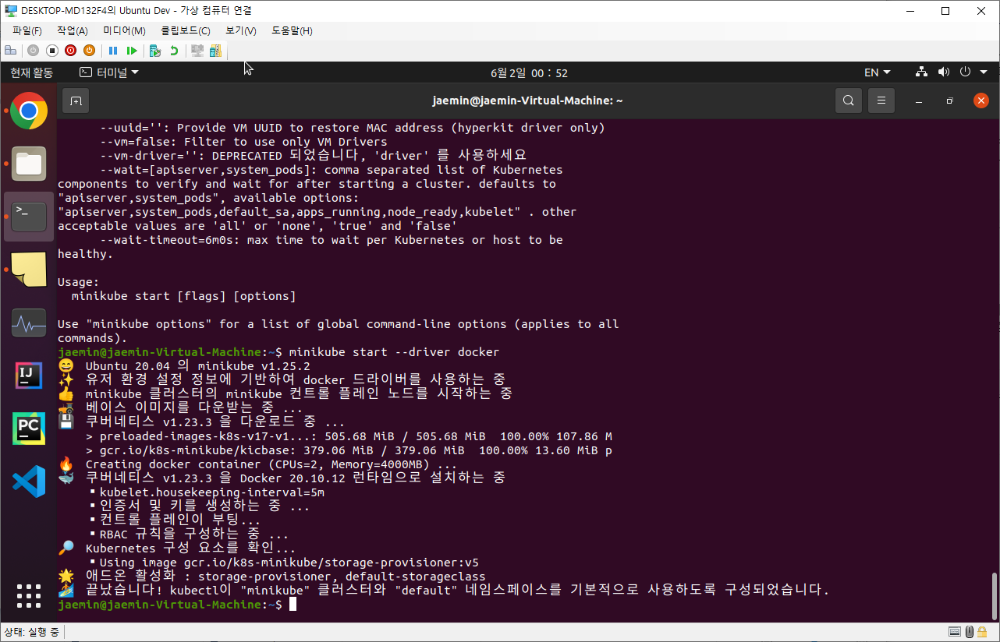

# 컨테이너 기술은 어떻게 발전했는가?

_"어떻게 서비스를 효율적으로 운영할 것인가?"_ 라는 질문에 대한 발전 과정을 묘사함.

## 첫 번째 단계: Traditional Deployment

하드웨어/OS에 바로 라이브러리랑 앱 넣어두고 돌림.  
비용효율성에 대한 필요성 대두: 컴퓨팅 자원을 최대한 잘 쓸 수 있는 방법은?  
ex) App1은 L1 라이브러리를 V1으로 쓰고, App2는 V2 버전으로 씀. 공유 라이브러리로 설치하면 충돌이 생기는데, 어떻게 해결할 수 있을까?

## 두 번째 단계: Virtualized Deployment

하드웨어/OS 위에 Hypervisor라는 컴포넌트가 존재하고, Hypervisor가 Virtual Machine들을 관리.  
각 Virtual Machine들은 GuestOS로서 에뮬레이팅(본 OS로부터 컴퓨팅 자원을 할당받음)되어 동작함.  
각 App이 서로 다른 Virtual Machine 안에서 동작하므로 서로 종속성을 가지지 않음.  
단, 에뮬레이션을 활용하다보니 컴퓨팅 성능 활용 면에서 효율성이 떨어짐.  
또, Virtual Machine 사용을 위한 하드디스크 용량도 부담이 됨.

## 세 번째 단계: Container Deployment

하드웨어/OS 위에 Container Engine이 Container를 하나의 프로세스로서 동작시킴.  
Docker는 이 Container Engine 중 하나이며, 유일/최초는 아니지만 가장 메이저.  
각 Container는 프로세스처럼 동작하기 때문에 HostOS에서 봤을 때는 일반 프로세스와 별 다를 바가 없지만, 격리 기술 몇 가지가 첨가됨.  
chroot를 이용한 filesystem 격리 / namespace를 활용한 proc. id 격리 / 네크워크 격리

## 네 번째 단계: Kubernetes Deployment

Kubernetes라는 Container Orchestration System을 통해 Container를 관리.  
Container Engine은 하나의 컴퓨터 안에서 어떻게 Container를 돌릴지 관리하는 소프트웨어.  
Container Orchestration System은 여러 서버로 구성된 클러스터에서 어떻게 Container를 돌릴지 관리하는 소프트웨어.

# 도커 기초: 파트 개요 및 실습 준비 (Ubuntu)

- docker 설치
- docker-compose 설치
- 추가로 kubernetes 구동을 위해 minikube 준비(cpu 2 core 이상 + ram 2gb 이상)

## docker / docker-compose 설치

### docker

링크 참조하여 설치 진행: https://docs.docker.com/engine/install/ubuntu/  
상기 과정으로 설치하면 관리자 권한으로 동작을 하는데, Docker 사용자 그룹에 소속되어야 Docker 사용이 가능.  
현재 linux 사용자를 "docker" 사용자 그룹에 넣어야 함. (로컬에서만 하면 괜찮겠지만... 공유 서버에서는 중요함)  
sudo usermod -aG docker $DOCKER_USER

### docker-compose

공식 url로부터 실행파일을 받아 /usr/local/bin/ 폴더에 넣어두는 방식.

## kubectl / kustomize 설치

### kubectl이란?

kubectl은 kubernetes의 API 서버와 통신하여 사용자 명령을 전달할 수 있는 CLI 도구. (shell?)  
kubernetes는 기본적으로 여러 서버가 합쳐진 클러스터에서 동작하는 것을 가정하고 있고, master node / worker node가 있음.  
master node에 API 서버가 존재하며, 외부 인터페이스로 활용.  
kubectl을 통해 인증+명령 전송 등의 액션을 할 수 있음.

### kubectl 설치

링크 참조하여 설치 진행:
https://kubernetes.io/ko/docs/tasks/tools/install-kubectl-linux/

### kustomize란?

kustomize는 kubernetes의 매니페스트 파일을 효율적으로 관리할 수 있게 도와주는 도구.  
매니페스트란? orchestration system에 올라갈 app 정보들을 관리하는 파일.  
이 매니페스트 파일을 kubectl에서 매니징을 하는데, app 정보가 많아지면 관리가 빡세짐.  
관리의 불편함을 해결하기 위해 생성된 오픈소스 도구: helm이라는 도구와 양대산맥.

### kustomize 설치

kustomize가 kubectl에 내장되어 같이 설치되긴 함.
따로 설치하려면 공식 url로부터 실행파일을 받아 /usr/local/bin/ 폴더에 넣어두는 방식. (실습 중에는 따로 설치)

## minikube 설치

### minikube란?

작은 kubernetes를 지향하며, 가상 환경을 사용하여 kubernetes 클러스터를 구현.
이 처럼 간단한 kubernetes 환경을 만드는 오픈소스 프로젝트가 많음 (minikube, k3s 등)
"드라이버"라는 개념을 활용해 원하는 가상 환경을 제공함. 이 가상 환경에서 골라서 kubernetes 환경을 구성할 수 있는 것.  
이 과정에서는 docker container 위에서 kubernetes를 구성해 사용할 예정.  
물론 실제 운영 서버 등에서 사용하긴 어려운 수준임.

### minikube 설치

링크 참조하여 설치 진행: https://minikube.sigs.k8s.io/docs/start/  
2 core cpu, 2GB ram, 20GB disk space 필수.

### kubernetes 클러스터 구성

minikube start 명령어를 통해 클러스터 구성이 가능.  
  
kubernetes 1.23.3 버전을 Docker 20.10.12 버전을 기반으로 돌리는 모습.  
kubectl도 이와 자동으로 연동되어 configuration이 가능하게 됨.  
kubectl config 정보는 ~/.kube/config 파일로 저장. (minikube 기반이므로 사실 야매임)  
루트 키로 클러스터 목록, 컨텍스트 목록, 유저 목록 존재.  
클러스터 목록은 관리할 쿠버네티스 노드 목록을 array 형태로 정리.  
유저 목록은 인증 된 사용자 정보를 목록으로 관리.  
컨텍스트 목록은 인증 리스트로 이해 가능.(어떤 클러스터가 어떤 유저와 어떻게 인증하고 통신할지 define)  
클러스터와 유저 정보는 같은 파일 안의 클러스터 목록과 유저 목록에서 따옴.  

### minikube 기본 사용법
* kubernetes 클러스터 상태 확인  
`$ minikube status`
* kubernetes 클러스터 중지  
`$ minikube stop`
* kubernetes 클러스터 삭제  
`$ minikube delete`
* kubernetes 클러스터 일시 중지  
`$ minikube pause`
* kubernetes 클러스터 재개  
`$ minikube unpause`
* minikube 애드온 목록 확인  
`$ minikube addons list`
* minikube 애드온 활성화  
`$ minikube addons enable [addon]`
* minikube 애드온 비활성화  
`$ minikube addons disable [addon]`
* 쿠버네티스 클러스터 노드에 SSH 접속  
`$ minikube ssh`
* 쿠버네티스 클러스터 버전과 대응되는 kubectl 사용  
`$ minikube kubectl ...`

# 부록

## 용어 정리
* k8s (Kubernetes): 쿠버네티스의 약식 표기, K와 s사이에 있는 8글자를 8로 축약
* k3s (Light weight Kubernetes): 컨테이너 관련 기술을 주로 개발하는 Rancher Labs에서 개발한 쿠버네티스의 경량화 버전
