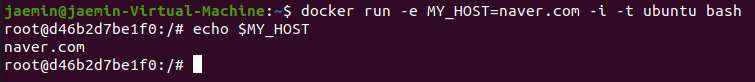
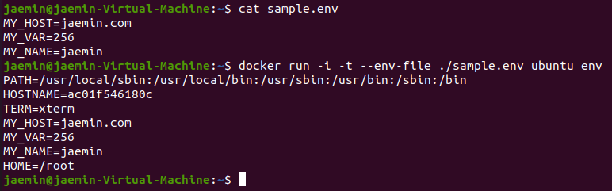
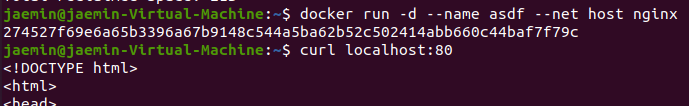
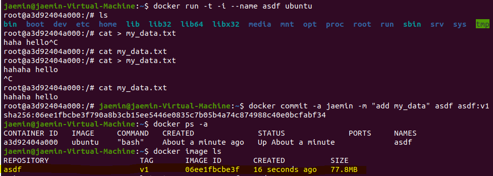
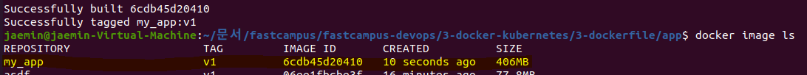
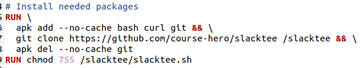

# 도커 구성 요소

지난 시간에 설치한 것이 두 가지인데, CLI로 우리가 제어하는 것은 도커 클라이언트이며, 데몬으로 백그라운드에 돌고 있는 것이 도커 엔진.  
도커 엔진이 띄워져있는 서버를 도커 호스트(이미지랑 컨테이너를 관리)라 칭하며, 클라이언트 쪽과 분리된 노드일 수 있음.  
이미지를 만들 때 저장하는 공간을 레지스트리 라고 부름.  
레지스트리에 다른 사람들이 올려둔 이미지를 로컬에 저장하거나 내 이미지를 레지스트리에 올릴 수 있음.  
이미지를 실행시켜 프로세스 형태로 돌리게 되면 이게 바로 컨테이너가 됨.  

# 도커 이미지와 컨테이너

이미지와 컨테이너는 도커의 가장 기본적인 단위.  
이미지 : 컨테이너 = 1 : N

## 이미지

* 컨테이너를 생성할 때 필요한 요소.
* 컨테이너의 목적에 맞는 바이너리와 의존성이 설치되어 있음.
* 여러 개의 계층으로 된 바이너리 파일 형태.

## 컨테이너

* 호스트와 다른 컨테이너로부터 격리된 시스템 자원과 네트워크를 사용하는 _"프로세스"_.
* 이미지는 읽기 전용 (명세), 변경사항은 컨테이너 계층에 저장(런타임 실행 결과). = 컨테이너에서 뭘 지우든 어쩌든 이미지는 불변

dockerfile -(build)-> docker image -(run)-> container  

## 어떤 관계와 비슷할까
image vs container  
program vs process  
class vs instance  
etc...

# 도커 이미지 이름 구성

(저장소 이름)/(이미지 이름):(이미지 태그) 형태.  
* fastcampus/nginx (태그 생략)
* fastcampus/nginx:1.21
* nginx/latest (저장소 생략, 도커 허브에서 가져옴)
* nginx (저장소 + 태그 생략, latest로 인식)

# 도커 이미지 저장소=리퍼지터리

이미지 리퍼지터리는 도커 이미지를 관리하고 공유하는 서버 어플리케이션.  
public: 도커 허브, Quay 등  
private: AWS ECR, docker registry 등

# 도커 컨테이너 라이프 사이클


# 컨테이너 시작하기

* 컨테이너 생성  
`$ docker create [image]`
* 컨테이너 생성 및 시작 (major)  
`$ docker run [image]`  
* 컨테이너 시작  
`$ docker start [container]`
이미지 없을 시 자동으로 pull

# 컨테이너 시작 주요 옵션

$ docker run \  
-i \  # 호스트 std input을 컨테이너와 연결(t와 세트?)  
-t \  # tty 할당 (i와 세트?)  
--rm \  # 컨테이너 실행 종료 후 자동 삭제  
-d \  # 백그라운드 모드로 실행 (detached)  
--name hello-world \  # 컨테이너 이름 지정  
-p 80:80 \  # 호스트 - 컨테이너 간 포트 바인딩  
-v /opt/example:/example \  # 호스트 - 컨테이너 간 볼륨 바인딩  
fastcampus/hello-world:latest \  # 실행할 이미지  
my-command  # 컨테이너 내에서 실행할 명령어

# 컨테이너 상태 확인

* 실행중인 컨테이너 상태 확인  
`$ docker ps`
* 전체 컨테이너 상태 확인  
`$ docker ps -a`
* 컨테이너 상세 정보 확인  
`$ docker inspect [container]`

# 컨테이너 일시중지 및 재개

* 컨테이너 일시중지  
`$ docker pause [container]`
* 컨테이너 재개  
`$ docker unpause [container]`

# 컨테이너 종료

* 컨테이너 종료 (SIGTERM 시그널 전달)  
`$ docker stop [container]`
* 컨테이너 강제 종료 (SIGKILL 시그널 전달)  
`$ docker kill [container]`
* 모든 컨테이너 종료  
`$ docker stop $(docker ps -a -q)`  
$의 의미는 저 괄호 안의 결과를 그대로 사용하겠다는 뜻.

# 컨테이너 삭제

* 컨테이너 삭제 (실행중인 컨테이너 불가)  
`$ docker rm [container]`
* 컨테이너 강제 종료 후 삭제 (SIGKILL 시그널 전달)  
`$ docker rm -f [container]`
* 컨테이너 실행 종료 후 자동 삭제  
`$ docker run --rm ...`
* 중지된 모든 컨테이너 삭제  
`$ docker container prune`

# 엔트리포인트와 커맨드

* 엔트리포인트: 도커 컨테이너가 실행할 때 무조건 실행되는 스크립트/명령어  
생략 가능 (이 경우 커맨드에 지정된 명령어로 수행)
* 커맨드: 도커 컨테이너가 수행할 명령어 or 엔트리포인트에 지정된 명령어에 대한 패러미터

실제 수행되는 컨테이너 명령어:  
(엔트리포인트) (커맨드)  
엔트리포인트와 커맨드는 모두 docker inspect 명령어로 확인 가능!

## dockerfile

도커파일 예제:  
```
FROM node:12-alpine
RUN apk add --no-cache python3 g++ make
WORKDIR /app
COPY . .
RUN yarn install --production

ENTRYPOINT ["docker-entrypoint.sh"]
CMD ["node"]
```
이 경우, 실제 동작하는 최종 커맨드는 아래와 같음:  
docker-entrypoint.sh node

## 도커 명령어

이 경우 dockerfile에 적힌 엔트리포인트를 무시하고 명령어에 적힌 엔트리포인트와 커맨드로 강제 실행.  
명령어 예제:  
```
$ docker run --entrypoint sh ubuntu:focal
$ docker run --entrypoint echo ubuntu:focal hello world
```

# 도커 환경 변수

--env 옵션을 통해 컨테이너 안으로 환경 변수를 넘길 수 있음.  
명령어 예제:  
  

--env-file 옵션으로 파일로도 전달 가능.  
명령어 예제:  


각 이미지마다 지정된 환경 변수는 아래 링크에서 각 이미지를 검색해보면 확인 가능:  
https://hub.docker.com/

# 명령어 실행: docker exec

docker exec [container] [command]: 실행 중인 컨테이너에 명령어를 전달.  
꼭 새로 이미지를 만들거나 실행하지 않더라도 해당 컨테이너에 접속/접근이 가능.
```
# my-nginx 컨테이너에 Bash 셸로 접속하기
$ docker exec -i -t my-nginx bash

# my-nginx 컨테이너에 환경변수 확인하기
$ docker exec my-nginx env
```

# 컨테이너 네트워크

## 도커 네트워크 구조

컨테이너를 시작할 때 사용할 네트워크를 지정할 수 있음(따로 지정 안하면 docker0 사용).  


* eth0: 호스트 OS가 사용하는 네트워크
* docker0: 도커 엔진이 생성하는 기본 생성 브릿지 네트워크
* lo: 컨테이너 내 로컬 네트워크 드라이브
* veth: 컨테이너의 eth0에 대응되는 가상 eth. 컨테이너가 하나 씩 따로 가지고 있음.

## 컨테이너 포트 노출

컨테이너의 포트를 호스트의 IP:PORT로 포워딩하여 컨테이너에서 제공하는 서비스를 외부로 노출할 수 있음.
`$ docker run -p [HOST IP:PORT]:[CONTAINER PORT] [container]`

```
# nginx 컨테이너의 80번 포트를 호스트 모든 IP의 80번 포트와 연결하여 실행
$ docker run -d -p 80:80 nginx

# nginx 컨테이너의 80번 포트를 호스트 127.0.0.1 IP의 80번 포트와 연결하여 실행
$ docker run -d -p 127.0.0.1:80:80 nginx

# nginx 컨테이너의 80번 포트를 호스트의 사용 가능한 포트와 연결하여 실행
$ docker run -d -p 80 nginx
```

## Expose vs Publish

expose 옵션(--expose)은 문서화/명세 용도이며, 실제 포트가 연결되지 않음.  
publish 옵션(-p)은 실제 포트를 바인딩. 

```
# expose 옵션은 그저 문서화 용도
$ docker run -d --expose 80 nginx

# publish 옵션은 실제 포트를 바인딩
$ docker run -d -p 80 nginx
```

## 도커 네트워크 드라이버

`$ docker network ls` 명령어를 통해 현재 docker에 설치 된 네트워크 드라이버 목록 확인 가능.  
* Single-host 네트워킹: bridge, host, none 옵션
* Multi-host 네트워킹: overlay 옵션 (docker swarm 에서 사용)

### Single-host 네트워킹


* none 옵션: 컨테이너에 네트워크 연결 없음
* host 옵션: 컨테이너가 가상 네트워크 사용하지 않고 호스트 OS의 네트워크 바로 사용  
아래처럼 포트 연결따위 없이도 호스트의 80 포트를 먹어버림  

* bridge 옵션: 기본 옵션이며, 컨테이너마다 veth가 붙고 가상 주소를 갖게 됨.  
이 경우 개인 설정으로 컨테이너 간 네트워킹 구성도 가능함.  

bridge 옵션 네트워킹 예시:  
```
# 개인 네트워크 선언
$ docker network create --driver=bridge fastcampus 

# 생성한 개인 네트워크에서 hello라는 도메인 네임의 nginx 컨테이너 생성
$ docker run -d --network=fastcampus --net-alias=hello nginx

# 생성한 개인 네트워크에서 grafana라는 도메인 네임의 grafana 컨테이너 생성
$ docker run -d --network=fastcampus --net-alias=grafana grafana/grafana
```

# 컨테이너 볼륨

## 도커 레이어 아키텍쳐


도커 이미지를 빌드하게 되면 위와 같은 레이어 구조로 되어있음.  
이미지 레이어(Read only) + 컨테이너 레이어(Read/Write)  
이미지 레이어에는 우분투 베이스에 필요한 패키지 설치, 파이썬 패키지 설치, 코드 복사 및 엔트리포인트 설정 등의 단계가 모두 각자의 레이어로 선언되어 따로 존재하고 있음.  
이 경우 이미지의 변화가 있더라도 기존 레이어 위에 새로운 레이어가 덧씌워지는 방식으로 운영. (아래 레이어 변경 없음)
이후 컨테이너 상에서 무언가 변경이 있을 경우 컨테이너 레이어에 변경을 가하게 됨.  
컨테이너 레이어는 컨테이너 종료 시 삭제.  

## 호스트 볼륨

호스트의 디렉토리를 컨테이너 내부 특정 경로에 마운트하는 개념. 당연히 연결 된다.  
컨테이너 레이어의 데이터는 휘발성이기 때문에 영구 저장 데이터가 필요할 경우 호스트 볼륨과 연결시켜 데이터를 호스트에 저장 → 이후 지속 사용하는 방식으로 운영이 가능함.
```
# 호스트의 /opt/html 디렉토리를 Nginx의 웹 루트 디렉토리로 마운트
$ docker run -d \
--name nginx \
-v /opt/html:/usr/share/nginx/html \
nginx
```

## 볼륨 컨테이너

다른 컨테이너에서 사용하는 볼륨을 지금 만들 컨테이너에서도 사용하게끔 하는 옵션.  
얘랑도 당연히 다이렉트로 연결.  
볼륨 하나를 다른 여러 컨테이너랑도 연결 가능.  
원래 소스는 호스트의 특정 경로이기 때문에 하나가 바뀌면 싹 다 같이 바뀐다.
```
$ docker run -d \
--name my-volume \
-it \
-v /opt/html:/usr/share/nginx/
html \
ubuntu:focal

# my-volume 컨테이너의 볼륨을 공유
$ docker run -d \
--name nginx \
--volumes-from my-volume \
nginx

# my-volume 컨테이너의 볼륨을 공유
$ docker run -d \
--name nginx_2 \
--volumes-from my-volume \
nginx
```

## 도커 볼륨

도커가 제공하는 볼륨 관리 기능을 활용해 데이터를 보존.  
굳이 호스트의 개인 폴더나 개인 파일을 사용하지 않아도 됨.  
기본 경로 값은 호스트 기준 /var/lib/docker/volumes/${volume-name}/_data
```
# web-volume 도커 볼륨 생성
$ docker volume create --name web-volume

# 도커 볼륨 목록 확인
$ docker volume ls

# 도커의 web-volume 볼륨을 mysql의 루트 디렉토리로 마운트
$ docker run -d \
--name fastcampus-mysql \
-v web-volume:/var/lib/mysql \
-p 3306:3306 \
mysql
```

## 읽기전용 볼륨 연결

볼륨 연결 시 끝에 `:ro` 옵션을 붙이면 해당 볼륨에 write 불가.  
```
# 도커의 web-volume 볼륨을 Nginx의 웹 루트 디렉토리로 읽기 전용 마운트
$ docker run -d \
--name nginx \
-v web-volume:/usr/share/nginx/html:ro \
nginx
```

# 컨테이너 로깅

## stdout, stderr

컨테이너에서 stdout, stderr로 내보내는 정보들은 도커 엔진의 로깅 드라이버가 쌓아서 처리할 수 있게 함.  
드라이버 종류도 많아서 취향에 맞게 선택.

## 로그 확인

* 전체 로그 확인
`$ docker logs [container]`
* 마지막 로그 10줄 확인
`$ docker logs --tail 10 [container]`
* 실시간 로그 스트림 확인
`$ docker logs -f [container]`
* 로그마다 타임스탬프 표시
`$ docker logs -f -t [container]`

## 호스트의 어디에 저장되나? (json-file 드라이버 전용)

호스트의 아래 경로에 저장 됨:  
`/var/lib/docker/containers/${CONTAINER_ID}/${CONTAINER_ID}-json.log`  
열어보면 로그 내용, out/err 종류, 시간 등이 행마다 json으로 적혀있음.


## 로그 용량 제한

```
# 한 로그 파일 당 최대 크기를 3Mb로 제한하고, 최대 로그 파일 3개로 로테이팅.
$ docker run \
-d \
--log-driver=json-file \
--log-opt max-size=3m \
--log-opt max-file=5 \
nginx
```

# 이미지 빌드

## 도커 이미지 구조


새로운 feature를 적용할 때 마다 새로운 레이어로 구성.  
컨테이너 환경에서는 이미지 레이어들 위에 R/W 레이어로 휘발성 데이터 작성 가능.  
레이어 정보는 `docker image inspect` 명령어로도 확인이 가능하며, `rootFS/Layers` 항목에 목록으로 정리되어 있음.

## 이미지 내 작업 후 커밋으로 이미지 생성

베이스가 되는 이미지 위에 새로운 정보를 덧씌우는 방식으로 새 이미지 생성이 가능.  
`docker commit [OPTIONS] CONTAINER [REPOSITORY[:TAG]]`

```
# ubuntu 컨테이너의 현재 상태를 my_ubuntu:v1 이미지로 생성
# -a: 누가 커밋 만들었는지 기록
# -m: 커밋 메시지
$ docker commit -a fastcampus -m “First Commit” ubuntu my_ubuntu:v1
```



## dockerfile로 이미지 생성

dockerfile이라는 파일을 통해 이미지 빌드가 가능.  
`(지시어) (패러미터)` 형태로 구성되어 있음.

```
# dockerfile 예제
FROM node:12-alpine # 어떤 이미지 기반인지 명세
RUN apk add --no-cache python3 g++ make
WORKDIR /app # 워킹 디렉토리 명세, 우분투 OS에서 해당 OS로 이동한다는 개념.
COPY . . # (SRC_호스트기준) (DST_이미지기준) 순서
RUN yarn install --production
CMD ["node", "src/index.js"]
```

dockerfile로 빌드하는 방법은 아래와 같음:  
`$ docker build [OPTIONS] PATH`

```
# ./ 디렉토리를 빌드 컨텍스트로 my_app:v1 이미지 빌드 (Dockerfile 이용)
$ docker build -t my_app:v1 ./

# ./ 디렉토리를 빌드 컨텍스트로 my_app:v1 이미지 빌드 (example/MyDockerfile 이용)
$ docker build -t my_app:v1 -f example/MyDockerfile ./
```




## 빌드 컨텍스트?

dockerfile을 빌드하다 보면 이런 문구가 있음:  
`Sending build context to Docker daemon ...`  
빌드 컨텍스트란, docker build 명령 수행 시 현재 디렉토리를 빌드 컨텍스트라고 함.  
dockerfile에 나온 이미지 빌드 정보를 도커 데몬에게 전달하기 위한 목적.

## .dockerignore

특정 디렉토리 혹은 파일 목록을 빌드 컨텍스트에서 제외하기 위한 목적.  
.gitignore와 동일한 문법.

# dockerfile 문법

정식 doc은 아래 링크 참조:  
https://docs.docker.com/engine/reference/builder/  

단, 환경 변수 사용 시 조심해야 함.  
* `ENV` 지시어로 컨테이너 내 환경 변수 선언/값 할당 가능.
* `ARG` 지시어로 컨테이너 내 환경 변수 선언 가능.  
단, `ARG` 지시어를 사용할 때는 선언-값 할당 단계가 꼭 필요하며, `ARG` 지시어 사용보다 먼저 사용하게 되면 기본값이 적용 됨.
* `ARG` 지시어와 `ENV` 지시어의 변수 선언이 겹치면 `ENV` 지시어 우선.

추가적으로 알아둘 부분?
* 패키지와 소스 레이어 분리를 위해, COPY 지시어를 두 번에 걸쳐 나눠 쓸 수 있음.  
ex) `COPY package*.json ./` 이후 `COPY . .`
* `EXPOSE` 지시어 쓴다고 해서 실제 포트가 배정되거나 열리는 것은 아님. 밖에서 이미지 퍼블리싱 옵션을 사용해야 하고, 문서화를 위한 개념.
* `CMD` 지시어 사용 시 띄어쓰기로 커맨드 명령어와 패러미터를 나눠도 되고, 그냥 string 하나로 넘겨도 동작.
* `ADD` 지시어도 존재하며, `COPY` 지시어와 역할은 비슷하지만 파일 경로 뿐 아니라 url도 받을 수 있음.

# 이미지 압축파일로 저장/불러오기 (offline 이미지 사용)

## 이미지 아카이브

아래 커맨드 문법을 사용:  
`# docker save -o [OUTPUT-FILE] IMAGE`

```
# ubuntu:focal 이미지를 ubuntu_focal.tar 압축 파일로 저장
$ docker save -o ubuntu_focal.tar ubuntu:focal
```

## 이미지 임포트

아래 커맨드 문법을 사용:  
`# docker load -i [INPUT-FILE]`

```
# ubuntu_focal.tar 압축 파일에서 ubuntu:focal 이미지 불러오기
$ docker load -i ubuntu_focal.tar
```

# 도커 허브 저장소 이용

공식 도커 허브 주소: https://hub.docker.com/  
가입하고 Settings > Security로 접속하면 access token 확인 가능.  
여기서 access token을 생성하면 CLI 환경에서 도커 허브 로그인이 가능함.  
아래 커맨드로 CLI 도커 로그인이 가능함:  
`docker login -u [MY_ID]`  
`/home/ubuntu/.docker/config.json` 파일을 뜯어보면 요 인증키가 그대로 저장되어 있음. 관리 주의!  
Repositories 메뉴에 들어가면 개인 이미지 저장도 가능.  
Create Repository로 개인 리퍼지터리 생성 → 도커 환경에서 원하는 이미지에 리퍼지터리 이름을 태깅 → `docker push [IMAGE]` 명령어로 리퍼지터리에 이미지 push!  
이렇게 올라간 이미지를 pull 받으려면 `docker pull [IMAGE]` 명령어 사용(권한 없으면 pull 불가).

# AWS ECR 저장소 활용

AWS ECR = Elastic Container Registry  
이 저장소도 private/public 리퍼지터리를 관리할 수 있음.  
ECR에서 리퍼지터리 먼저 생성 → TAG → PUSH로, 도커 허브 저장소와 동일한 과정으로 진행.  
단, AWS 로그인 시퀀스가 추가되어야 함(커맨드를 아예 알려주므로 그거 그대로 복붙하면 된다).

# 이미지 경량화 전략

## 이미지 경량화란?

도커 빌드를 통해 생성되는 이미지의 용량을 줄이는 작업.  
도커 이미지의 용량이 작을수록 push 속도 상승 + pull 속도 상승 + 이미지 컨테이너 띄우는 속도 상승 + 노드 내 컨테이너 최대 수 상승 등의 효과를 가져옴.

## 필요한 패키지/파일만 추가

종속성을 최대한 타이트하게 잡아야 용량 확보 가능.  
당장 사용하지 않을 패키지 / 배포 환경에 굳이 필요 없는 패키지는 제거해야 좋음

## 컨테이너 레이어 수 줄이기

레이어 수 = dockerfile 내 지시어 수 (WORKDIR, COPY 등)  
레이어 수가 적을수록 용량이 줄어듬.  
RUN 같은 경우 여러 개로 나누지 말고 하나로 통합하는 방식으로 레이어 수를 줄일 수 있음.  
아래 경우는 apk, git clone 등으로 필요한 패키지를 설치하는 과정을 && 구문으로 하나의 커맨드로 묶어버린 예제.  



+) 이미지에는 캐시가 필요 없으므로, 데이터 저장 후 캐시를 날려버리는 구문도 있음(`--no-cache`)

## 경량 베이스 이미지 선택

* debian slim
* alpine
* stretch

node의 경우 16 버전이 905MB,  
debian slim 기반의 16-slim 버전이 174MB,  
alpine 기반의 16-alpine 버전이 110MB 임.

## 멀티 스테이지 빌드 사용

멀티 스테이지 파이프라인이란, 임시 이미지를 여러 번 빌드하는 방식으로 이미지를 만드는 방식.  
`FROM [IMAGE] AS [STAGE_NAME]` 형태로 사용이 가능.  
하나의 이미지 안에서 만들어지는 스테이지는 서로 파일을 제공할 수 있고, 베이스가 될 수 있으며, 이미지를 유연하게 빌드할 수 있음.  
빌드 때 사용되는 의존성이 많아질 수록 멀티 스테이지 빌드로 의존성을 최적화해서 용량을 줄일 수 있음.  


# 도커 데몬 디버깅

* 현재 도커 환경 정보  
`docker system info`
* 도커 환경에서 새롭게 발생하는 이벤트를 실시간으로 확인 (= 도커 로그 실시간 트래킹)  
`docker system events` = `docker events`
* (우분투 전용) 도커 데몬 로그 확인  
`journalctl -u docker`
* 도커 환경 디스크 사용량 확인  
`docker system df [-v]`
* 도커 환경 데이터 정리  
`docker system prune`
* 도커 컨테이너 컴퓨팅 자원 사용량 실시간 확인
`docker stats`