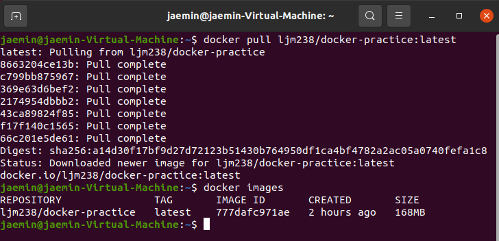
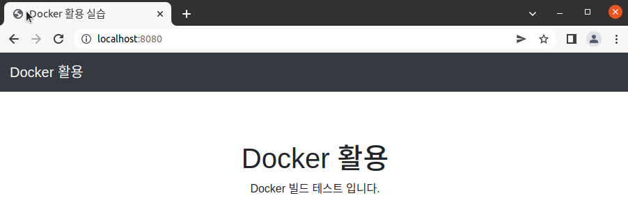

# Docker 빌드를 위한 Jenkins 활용 소개

## 빌드란 무엇인가?

소스 코드를 실행 가능한 standalone 소프트웨어 아티팩트로 변환하는 과정 혹은 그 결과를 말함.  
가장 중요한 부분은 소스 코드 파일이 실행 코드로 변환되는 _컴파일_ 과정.  
빌드 과정은 일반적으로 빌드 도구에 의해 관리 됨.

## 빌드 방식

* 전체 빌드  
매 빌드마다 전체 코드를 포함하여 빌드.
* 증분 빌드  
변경된 코드 대상만 분리하여 빌드.  
전체 빌드보다 빠르고 리소스를 덜 사용함.  
도커의 빌드 방식도 이와 비슷함.  

## 도커의 빌드

도커는 이미지가 있어야 컨테이너 생성/동작이 가능함.  
도커 이미지를 생성하는 과정을 도커 빌드라 부르며, 이 과정에서 dockerfile이 필요함.  
이미지 내에서는 레이어 구조가 있으며, 구성 요소 별로 서로 다른 레이어에 위치하게 된다(stack 구조).  
이런 이미지를 돌리면 가장 위에 있는 이미지 레이어를 기반으로 컨테이너를 생성함.  
서로 다른 레이어들은 유니온 파일 시스템을 통해 하나의 파일 시스템으로 다뤄짐.  

## 도커 빌드 명령어

* 기본 빌드 명령어:  
`- docker build -t <생성할 이미지명> <빌드할 코드 경로>`
* dockerfile 지정을 위한 ‒f 옵션 적용:  
`- docker build -t <생성할 이미지 명> -f <dockerfile 파일명> <빌드할 코드 경로>`

## 젠킨스란?

JVM 위에서 동작하는 DevOps 자동화 워크플로우 툴.  
커스텀 워크플로우를 구현하여 CI/CD를 구현 가능.  
도커에도 적용이 가능하여 이미지 빌드, 배포가 자동화될 수 있음.  

# Gradle을 활용한 빌드 준비

## Gradle이란?

Gradle은 Groovy를 이용한 빌드 자동화 시스템이다.  
Groovy와 유사한 도메인 언어를 채용하였으며,  
현재 안드로이드 앱을 만드는데 필요한 안드로이드
스튜디오의 공식 빌드 시스템.  
Java, C/C++, 파이썬 등 여러가지
언어 지원.
build.gradle 파일로 프로젝트 내 빌드 플러그인, 종속성 등을 관리하며,  
settings.gradle 파일로 프로젝트 이름 등의 프로젝트 관련 설정들을 관리함.

## Jib이란?

Jib은 Docker 데몬 없이 + Docker 권장사항에 대한 깊은 숙달 없이도,
Java 애플리케이션에 최적화된 Docker 및 OCI 이미지를 빌드함.  
Maven 및 Gradle용 플러그인과 자바 라이브러리로 사용이 가능.  
레이어 별 종속성을 확인하고 변경된 레이어만 배포가 가능.  
배포 시 도커 파일 불필요!  


## Jib 설정

* build.gradle 파일에서 jib 플러그인 추가  


* build.gradle 파일에서 jib 최상위 항목 생성 후 아래에 이미지 빌드 상세를 명세  


# Gradle 프로젝트 실습

## Gradle 설치

ubuntu 환경에서 apt install gradle 하면 옛날 버전으로 깔림.  
최신 버전 설치를 위해서는 아래 링크처럼 진행이 필요함:  
https://docs.gradle.org/current/userguide/installation.html  
아니면 속 편하게 snap으로 설치해도 가능.  
`sudo snap install gradle`  
단, 최신 버전으로는 올라오지 않고 몇 개월 정도 예전 버전으로 설치.

## Gradle 프로젝트 만들기

`gradle init` 명령어를 쓰면 아래 링크처럼 프롬프트 과정을 거쳐 하나의 프로젝트가 생성됨.  

```
$ gradle init

Select type of project to generate:
  1: basic
  2: application
  3: library
  4: Gradle plugin
Enter selection (default: basic) [1..4] 2

Select implementation language:
  1: C++
  2: Groovy
  3: Java
  4: Kotlin
  5: Scala
  6: Swift
Enter selection (default: Java) [1..6] 3

Select build script DSL:
  1: Groovy
  2: Kotlin
Enter selection (default: Groovy) [1..2] 1

Select test framework:
  1: JUnit 4
  2: TestNG
  3: Spock
  4: JUnit Jupiter
Enter selection (default: JUnit 4) [1..4]

Project name (default: demo):
Source package (default: demo):


BUILD SUCCESSFUL
2 actionable tasks: 2 executed
```

물론 이 과정 거치지 않고 모든 패러미터를 커맨드에 때려박아도 동작.  
`gradle init --dsl=groovy --type=java-application \
--test-framework=junit`  

## Gradle 프로젝트 빌드

프로젝트 루트 디렉토리에서 `gradle build` 명령어로 빌드가 가능하며, 빌드 이후 뭔가 파일들이 많이 생김.  
최종 패키징 된 결과물은 java의 경우 `./app/build/libs/*.jar` 파일 형태로 결과물이 나오게 됨.  

## jib 통한 도커 이미지 빌드

* 아래 예시는 https://github.com/DevOpsRunbook/FastCampus 리퍼지터리를 기반으로 진행 됨.  

* from: 어느 이미지를 베이스로 할 것인가?
* to: 어느 레퍼지토리에 어떤 이름, 어떤 태그로 push할 것인가?  
url 명세 없을 시 도커 허브가 기본 값.
* container: 컨테이너 내부 설정 관련.
  * entrypoint: 컨테이너 실행 시 최초로 실행되는 키워드를 정리하는 영역.
  * jvmFlags: 자바 관련 옵션을 정리하는 영역.
  * ports: 컨테이너 포트 명시.
  * environment: 환경 변수 설정 영역.
  * labels: 컨테이너 라벨 정의.
  * creationTime: 빌드 타임 정의.
  * format: 도커 환경 명시.
* extraDirectories: 타 디렉토리에서 특정 패키지 혹은 파일 가져오기 위해 명시(종속성 떄문?).

위 설정을 기반으로 jib에서 도커 이미지를 빌드하고 도커 허브에 이미지를 push하며, 도커 허브에서 타 노드에서 이미지를 pull 받을 수 있음.

./gradlew jib 커맨드 결과:


위 이미지를 도커 pull 받는 결과:


pull 받은 이미지 컨테이너로 돌린 결과:  



# 젠킨스 프로젝트 실습

## 젠킨스란?

소프트웨어 개발 시 Continuous Integration
서비스를 제공하는 툴.  
다수의 개발자들이 하나의 프로그램을 개발할 때 버전 충돌을 방지하기 위해 각자 작업한 내용을 공유 영역에 있는 Git등의 저장소에
빈번히 업로드 함으로써 지속적 통합을 구현하는데, 이를 돕는 툴임.

젠킨스의 특징:
* 빌드 자동화
* 자동화 테스트
* 코드 품질 검사
* 빌드 파이프라인 구성

## 젠킨스 플러그인

오픈 소스 커뮤니티에서 젠킨스에 추가 기능을 부여하기 위해 많은 플러그인이 존재함.  
아래 링크에서 확인 및 설치 가능:  
https://plugins.jenkins.io/

## 젠킨스 설치

젠킨스는 컨테이너 기반으로 설치 및 실행이 가능하며, 정상 실행 시 특정 포트 연결하여 web 기반으로 접속이 가능.  

젠킨스 컨테이너 실행 명령어:  
`$ docker run --name jenkins -d -p 8080:8080 -v ~/jenkins:/var/jenkins_home
-u root jenkins/jenkins:latest`

젠킨스 admin password 확인 명령어:  
`$ docker exec -it jenkins bash -c "cat
/var/jenkins_home/secrets/initialAdminPassword`

## 젠킨스와 깃헙 연결

일단 현재 노드에서 rsa 방식의 ssh 키를 생성.  
id_rsa 파일(= 개인키)은 젠킨스에 등록 / id_rsa.pub 파일(= 공개키)은 깃헙에 등록.  

깃헙에 ssh 공개키를 등록한 결과:  


젠킨스에서 Manage Credentials > Jenkins Store > Global Credentials (unrestricted) > Add Credentials 선택  
이후 창에서 이름/설명을 작성하고 서버의 id_rsa 개인키 내용을 입력하면 등록.  

젠킨스에 개인키를 등록한 결과:  


## 젠킨스와 AWS 연결

AWS 노드가 가지는 고유한 Access Key를 등록하고, AWS를 배포 서버로 사용할 경우 AWS 내 pem 키 정보까지 추가해야 함.

# CI 전체 구현 실습


위 사진에서는 배포 환경으로 AWS 환경을 사용했으나, 본 진행에서는 노드 하나에서 배포를 진행하도록 함.

## 파이프라인 잡 생성

1. 젠킨스 홈에서 새로운 Item 선택.
2. Pipeline 선택하고 이름 입력 후 OK.
3. GitHub Project > url에 깃헙 주소 입력.
4. 아래 Pipeline 설정에서 definition을 Pipeline script from SCM 선택.  
이는 Pipeline 과정을 소스 상에서 관리하겠다는 의미.
5. SCM을 git을 등록하고(형상 관리 툴 선택) Repository URL에 깃헙 리퍼지터리의 ssh 주소, Credentials에 아까 등록했던 ssh-key를 선택.
6. Script Path에 깃헙 리퍼지터리 경로 내 어디에 Jenkinsfile이 있는지 명시.
7. 저장 & 완성!

## Jenkinsfile

젠킨스 파이프라인을 파일로 명세한 것으로, Pipeline script from SCM 옵션을 사용한 파이프라인의 경우 리퍼지터리 내 Jenkinsfile에 기반하여 동작.  

```
def CONST_STRING = 'const_string'

pipeline {
  stages {
    stage('STAGE NAME') {
      steps {
        sh """
        cd ...
        copy ...
        """
      }
    }
  }
}
```

기본적으로 {} 중괄호 안에 이름-정보 형태로 구성되어 있고, 자주 사용하는 패러미터(주로 경로/주소가 되지 않을까?)는 아예 def 키워드를 통해 정의가 가능.  

# 부록

## Gradle vs Gradle Wrapper(gradlew)

Gradle Wrapper는 Gradle을 각 개발자나 CI 서버에 깔지 않고, 프로젝트에 함께 포함시켜 배포할 수 있는 방법을 제공.  
따라서 Gradle 빌드를 실행하는 데 권장되는 방법은 Gradle Wrapper를 사용하는 것.  
Wrapper는 선언 된 버전의 Gradle을 호출하여 필요한 경우 미리 다운로드하는 스크립트이기 때문에 결과적으로 수동 설치 프로세스를 수행하지 않고도 Gradle 프로젝트를 신속하게 시작할 수 있기 때문.  
gradle build를 사용하면 컴퓨터에 설치된 gradle과 java를 기준으로 build 하고, ./gradlew build를 실행하면 build.gradle 파일에 정의한 내용을 기준으로 build 진행.  
즉, Gradle Wrapper를 사용하면 이미 존재하는 프로젝트를 새로운 환경에서 바로 빌드할 수 있음(환경에 종속되지 않음).