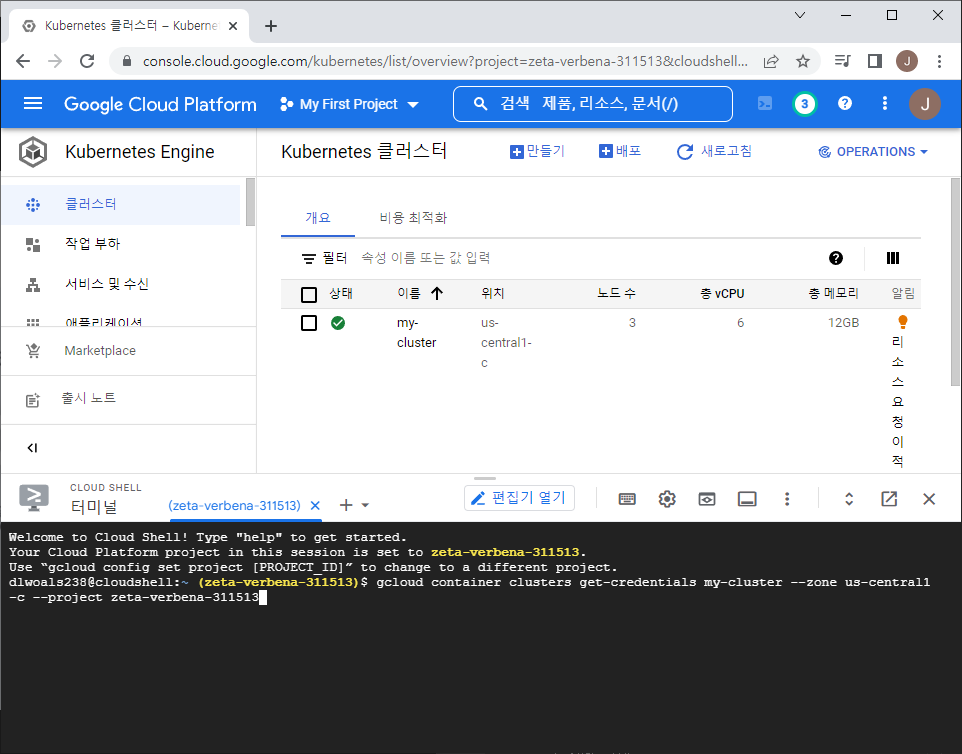
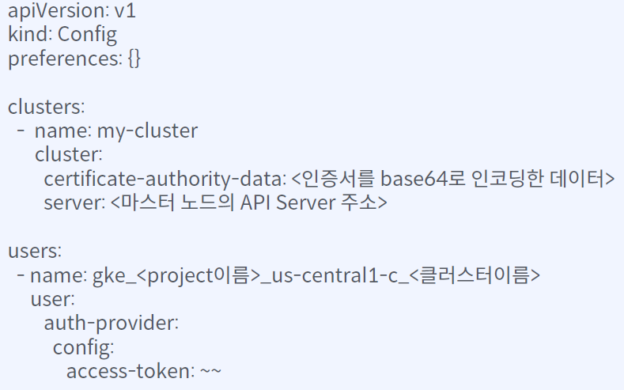

# 쿠버네티스 학습 과정

## 쿠버네티스 개요

* 클러스터 구성 요소 및 쿠버네티스 오브젝트 확인
* GCP 활용한 N개 노드 클러스터 구성

## Pod 이란?

* 노드에 Pod 배포 방법
* 컨테이너, Pod 간 네트워킹 방법

## Pod 복제 & 배포 전략

* 쿠버네티스 리소스로 가용성과 내결함성
* N개 Pod 배포를 위한 쿠버네티스 배포 전략

## 쿠버네티스 서비스 운영

* 쿠버네티스 로드밸런싱
* 컨테이너 헬스체크 매커니즘: liveness, readiness

## 쿠버네티스 실습

# 쿠버네티스 공식 Doc

https://kubernetes.io/ko/docs/home/

# 쿠버네티스는 왜 필요한가?

MSA가 퍼짐에 따라, 많은 수의 서비스를 빌드하고 배포해야 할 경우가 생김.  
이 business needs에 따라 쿠버네티스를 탄생시키게 됨.  

## 도커를 통해 어플리케이션을 배포할 때...

* 도커를 통해 어플리케이션을 빌드하여 이미지를 만들고, 이를 레지스트리 서버에 push
* 운영 서버에서 이미지를 pull 받아 컨테이너 실행

이런 서비스가 한두개라면 충분히 커버할 수 있겠지만, 수백 개라면 관리에 애로사항이 꽃피게 됨.  
단순 빌드 및 배포가 아니라, 각 서버의 리소스 모니터링까지 진행해야 한다면 일의 강도가 매우 높아짐.  

## MSA 환경에서 배포를 진행할 때...

MSA 시스템을 구성하여 운영할 경우, 각 서비스 별 트래픽을 예측해 사용할 리소스를 정해주고, 정해진 인스턴스에 정해진 컨테이너를 배포할 수 있음.  

이 경우 서버 별 리소스 사용량에 불균형이 발생할 수 있고, 리소스 낭비로 이어짐.  
그렇다고 리소스 사용량을 정확하게 예측하는 것은 불가능의 영역임(특히나 서비스가 수 백개 단위라면).  

또한 수 백개 단위의 서비스들을 운영할 때, 특정 서비스에서 복구가 필요할 경우 어떤 인스턴스인지 찾는 것도 일임.  

## 쿠버네티스는 이런 것들을 지원한다

* 자동화된 빈 패킹(bin packing):  
컨테이너 실행을 위한 쿠버네티스
클러스터 노드를 제공.  
각 컨테이너가 필요로 하는 컴퓨팅 자원을 쿠버네티스에 보고하면, 쿠버네티스는 컨테이너를 노드에 맞추어서 클러스터 내 리소스 최적화를 진행.
* 자동화된 복구:  
쿠버네티스는 실패한 컨테이너를 다시 시작하고, 컨테이너를 교체하며, '사용자정의 상태 검사'에 응답하지 않는 컨테이너를 죽임.  
이런 작업들은 외부에 공개되지 않음.
* 자동화된 롤아웃 & 롤백:  
쿠버네티스는 배포된 컨테이너의 원하는 상태를 서술할 수 있으며, 현재 상태를 원하는 상태로 설정한 속도에 따라 변경이 가능.  
예를 들어, 쿠버네티스로 배포용 새 컨테이너를 만들고, 기존 컨테이너를 제거하고, 모든 리소스를 새 컨테이너에 적용하는 과정이 자동화 됨.

## 구글 컨테이너 관리 시스템 히스토리

### Borg. 7

구글에서 개발한 최초의 통합 컨테이너 관리 시스템.  
자원 요구사항을 예측해 최적화하는 방식.  
Config 파일을 통해 서비스에 동적 반영 / 서비스 디스커버리 / 로드밸런싱 / 자동 scale-out 등의 기능 제공  

#### 서비스 디스커버리?

MSA에서 어플리케이션들이 계속 종료되고 재시작되는데, 어플리케이션이 실행되는 노드가 계속 바뀌는 형태.  
그럼 클라이언트는 IP를 특정할 수 없음.  
이 때 서비스 디스커버리 서버가 중간에 존재하면서 어떤 서비스가 어떤 주소를 가지는지 맵핑해주는 방식.


### Omega

클러스터 상태에 일관성을 부여하기 위해 클러스터 상태 저장기능 추가.  
낙관적 동시성 제어 방식을 채택해서 리소스 충돌을 해결.  

#### 낙관적 동시성 제어?

리소스 버전을 활용해 리소스 충돌을 해결하는 방식임.  
하나의 리소스를 여러 명이 열람하고 수정하려 할 때, 버전 관리를 하여 특정 클라이언트에서 이미 수정 된 버전을 기반으로 수정을 진행하려 할 때 거부하는 방식.  
git에서 컨플릭트 나는 거랑 비슷한데?  


### 쿠버네티스

Borg / Omega와 달리 오픈 소스!  
구글 퍼블릭 클라우드 인프라 사업을 위해 설계하고 개발.  
Omega처럼 리소스 변경 사항을 저장하기 위한 공유 영구 저장소가 있지만 쿠버네티스는 저장소에 접근하기 위한 REST API를 따로 관리함.  
주요 설계 목표는 리소스 활용의 이점을 더 누리면서 복잡한 분산 시스템을 쉽게 배포하고 관리할 수 있게 만드는 것.

# 쿠버네티스란 무엇인가?

쿠버네티스 = 조타수.  
여러 개의 컨테이너화 된 어플리케이션을 여러 서버(= 쿠버네티스 클러스터)에 자동으로 배포/스케일링 및 관리해주는 오픈 소스 시스템.

# 쿠버네티스 클러스터 구성 요소와 동작 방식

* 클러스터  
여러 서버를 하나로 묶은 집합.  
하나의 서버처럼 동작.
* 쿠버네티스 클러스터  
쿠버네티스의 관리 아래 어플리케이션 컨테이너를 배포하기 위한 서버들의 집합.  
* 마스터 노드  
클러스터 상태를 저장 & 관리
    * etcd (key-value data store): 클러스터에 배포된 어플리케이션 실행 정보를 저장 (이게 Omega 때 추가된 개념)
    * API Server: 클러스터 상태 조회, 변경을 위한 API 제공
    * Scheduler: 노드 스케쥴링
    * Controller Managers: 사용자가 시킨 컨테이너 관련 일에 대해 리소스를 관리하며, 추가 자원이 필요할 경우 API로 요청
* 워커 노드  
컨테이너 실행을 담당
    * Kubelet, Container Runtime (Docker, …): 실제 컨테이너 구동 영역
    * kube-proxy: 워커 노드로 들어오는 트래픽을 받기 위한 네트워크 입구

## 쿠버네티스에 어플리케이션을 배포하게 되면...

쿠버네티스 오브젝트 Manifest 파일을 작성해서 마스터 노드의 API Server에게 요청을 보냄.

### Manifest 파일?

쿠버네티스 오브젝트를 생성하기 위한 필수 정보.  
컨테이너를 돌릴 작업 명세서라고 보면 됨.

API가 새로운 컨테이너 생성 요청을 받았을 때, 아래와 같은 시퀀스 다이어그램처럼 동작하게 됨.


모든 구성 요소들은 API 서버랑만 통신하고, 모종의 옵저버 패턴을 활용해서 서로의 이벤트를 구독하고 있다고 추측이 되는 구조?

## 각 노드로 트래픽은 어떻게 전달이 되나?

모든 쿠버네티스 워커 노드에는 kube-proxy가 실행 중임.  
API 서버는 직접 kube-proxy에 접속하고, 타 서비스는 iptables라는 서비스를 통해 목적지 IP 주소를 확인하게 됨.


kube-proxy가 동일 주소로 매핑 된 여러 pod 중에서 하나를 선택(round-robin)해서 연결시켜 줌. 로드 밸런싱이네?

# 쿠버네티스 클러스터 구성 (GCP)

본 실습에서는 GCP Kubernetes Engine 제품을 활용.  
아무래도 구글의 자사 제품이다보니 기능 제공이 좋은가?  

Kubernetes Engine > API 시작 > 'Kubernetes 클러스터' 화면에서 만들기 버튼 선택 > GKE Standard 구성 선택

클러스터 기본 사항 메뉴에서 클러스터 이름 작성, 나머지는 다 디폴트 값  
왼쪽 default-pool 메뉴에서 노드 갯수 3개로 설정  
이후 클러스터 생성!

# 쿠버네티스 클러스터 접속 위한 환경 구성

쿠버네티스 클러스터와 통신하기 위해서는 kubectl 클라이언트가 필요.  

## 구글에서 제공하는 웹 기반 쉘로 접속하는 방법

구글 쿠버네티스 클러스터 서버 접속 정보가 필요함.  
방금 만든 클러스터에서 점3개 클릭 > 연결 선택  
GCP의 경우 웹 브라우저에서 쉘을 실행할 수 있는 서비스를 제공함. 이걸 CLOUD SHELL이라고 하는데,  
이걸 써서 작업할 경우 'CLOUD SHELL에서 실행' 버튼을 누르면 됨. 누른 결과는 아래와 같음.



이 상태에서 엔터를 바로 누르게 되면 현재 띄워진 쉘에서 쿠버네티스 클러스터 접속 정보가 구성이 됨.  
이후 쿠버네티스 접속 정보를 확인해보기 위해 `cat ~/.kube/config` 커맨드를 실행해보면 뭔가 데이터가 막 뜨는데, 이게 kubectl이 사용하는 config 파일이며 아래 형태로 생겼음.



이 상태에서 쿠버네티스 연결 상태를 확인해보자.  
`kubectl get pod` 명령어를 날려보면 `No resources found in default namespace.` 라는 메시지가 날아옴.  

## 로컬 머신에서 직접 클러스터에 접속하는 방법

gcloud 클라이언트가 필요함. 설치 정보는 아래 링크 참조:  
https://cloud.google.com/sdk/docs/install#installation_instructions

kubectl은 이전 강의에서 이미 설치했으므로 skip.  
gcloud 클라이언트 설치가 끝났다면 구글 접속 인증이 필요함.  
`gcloud auth login` 커맨드 실행하여 클러스터를 생성한 구글 계정으로 접속.  
이후 구글 쿠버네티스 클러스터 서버 접속 정보가 필요함.  
방금 만든 클러스터에서 점3개 클릭 > 연결 선택  
명령줄 액세스에 적힌 커맨드를 복사해서 로컬 터미널에서 실행시키면 클러스터로 접속.  
이 때 `cat ~/.kube/config` 커맨드로 현재 노드의 kubectl config에서 GCP 액세스 토큰이 잘 생성되었는지 확인하자.

이 상태에서 쿠버네티스 연결 상태를 확인해보자.  
`kubectl get pod` 명령어를 날려보면 `No resources found in default namespace.` 라는 메시지가 날아옴.

# 쿠버네티스 오브젝트란 무엇인가?

쿠버네티스 오브젝트 = "쿠버네티스 클러스터를 이용해 어플리케이션을 배포하고 운영하기 위해 필요한 모든 쿠버네티스 리소스"

우리가 쿠버네티스로 어플리케이션을 배포하고 관리한다는 것은, 어떤 어플리케이션을 얼마나, 어디에, 어떤 방식으로 배포할 것인가를 결정하는 것과 같음.  
이 결정사항, 의도를 쿠버네티스 오브젝트라 칭하며, 오브젝트를 담는 파일이 매니페스트 파일.  
yaml 파일 형식으로 작성되며, REST API 방식으로 전달됨.

```
어떤 어플리케이션을 -- Pod
얼마나 -- ReplicaSet
어디에 -- Node, Namespace
어떤 방식으로 배포할까 -- Deployment
트래픽을 어떻게 로드 밸런싱 할 것인가 -- Service, Endpoints
```

## 매니페스트 파일 작성 방식

오브젝트 생성을 위한 필수 정보로는 아래와 같은 것들이 있음.

```
apiVersion: apps/v1
kind: Deployment
metadata:
  name: my-nginx
  labels:
    app: nginx
spec:
  replicas: 3
  selector:
    matchLabels:
      app: nginx
  template:
    metadata:
      labels:
        app: nginx
    spec:
      containers:
      - name: nginx
        image: nginx:1.14.2
        ports:
        - containerPort: 80

```

* `apiVersion`: 오브젝트 생성 시 사용할 API 버전
* `kind`: 생성할 오브젝트 종류
* `metadata`: 오브젝트를 구분지을 수 있는 정보(name, resourceVesion, labels, namespace, …)
* `spec`: 사용자가 원하는 오브젝트 상태

## 쿠버네티스가 알려주는 status 필드

오브젝트가 쿠버네티스 클러스터에 생성되면 쿠버네티스는 오브젝트 정보에 status 필드를 추가해서 현재 실행 중인 오브젝트의 상태 정보를 업데이트.

```
status:
  availableReplicas: 2
  conditions:
    - lastTransitionTime: '2022-02-06T12:28:39Z'
      lastUpdateTime: '2022-02-06T12:28:39Z'
      message: Deployment has minimum availability.
      reason: MinimumReplicasAvailable
      status: 'True'
      type: Available
    - lastTransitionTime: 2022-02-06T12:28:16Z'
      lastUpdateTime: '2022-02-06T12:28:39Z'
      message: ReplicaSet 
      "my-app-5b7548d6b" has successfully progressed.
      reason: NewReplicaSetAvailable
      status: 'True'
      type: Progressing
      observedGeneration: 1
      readyReplicas: 2
      replicas: 2
      updatedReplicas: 2
```

결국, `spec` 영역에서 명세하는 것은 쿠버네티스가 달성해야 할 목표이며, 이는 `status` 영역으로 쿠버네티스가 표현.  

최종적으로 쿠버네티스 오브젝트의 라이프 사이클은 아래와 같음.  
1. 사용자가 쿠버네티스 오브젝트 yaml 파일 작성(spec 작성).
2. 쿠버네티스 API를 통해 쿠버네티스에 생성 요청.
3. 쿠버네티스 API server가 오브젝트 파일의 spec 파일을 읽고 오브젝트 생성.
4. 쿠버네티스 ControllerManager가 spec과 status를 비교하면서 계속 조정하고 상태를 업데이트.

# kubectl 사용 방법

* `kubectl api-resources`  
쿠버네티스 클러스터에서 사용 가능한 오브젝트 목록 조회
* `kubectl explain <type>`  
쿠버네티스 오브젝트의 설명과 1레벨 속성들의 설명 (apiVersion, kind, metadata, spec, status)
* `kubectl explain <type>.<fieldName>[.<fieldName>]`  
ex) `kubectl explain pods.spec.containers`  
쿠버네티스 오브젝트 속성들의 구체적인 설명(Json 경로)

* `kubectl get nodes`  
쿠버네티스 클러스터에 속한 노드 목록 조회
* `kubectl apply ‒f <object-file-name>`  
ex) `kubectl apply ‒f deployment.yaml`  
쿠버네티스 오브젝트 생성 / 변경
* `kubectl get pods`  
실행중인 Pod(컨테이너) 목록 조회

* `kubectl scale ‒f <object-file-name> --replicas=#`  
ex) `kubectl scale ‒f deployment.yaml --replicas=3`  
어플리케이션 배포 수를 조정(replicas: 복제본)
* `kubectl diff ‒f <object-file-name>`  
ex) `kubectl diff ‒f deployment.yaml`  
현재 실행중인 오브젝트 설정과 입력한 파일의 차이점 분석
* `kubectl edit <type>/<name>`  
ex) `kubectl edit deployment/nginx-deployment`: replicas를 4로 변경  
쿠버네티스 오브젝트의 spec을 editor로 편집

* `kubectl port-forward <type>/<name> <local-port>:<container-port>`  
ex) `kubectl port-forward pod/nginx-deployment-74bfc88f4d-fkfjc 8080:80`  
로컬 포트는 pod에서 실행중인 컨테이너 포트로 포워딩
* `kubectl attach <type>/<name> -c <container-name>`  
ex) `kubectl attach deployment/nginx-deployment -c nginx`  
현재 실행중인 컨테이너 프로세스에 접속, 로그 확인
* `kubectl logs <type>/<name> -c <container-name> -f`  
ex) `kubectl logs deployment/nginx-deployment -c nginx ‒f`  
현재 실행중인 컨테이너 프로세스에 모든 로그 출력(-f: watch 모드)