# IaC (= Infrastructure as Code) 란?

IaC란 코드 기반의 어플리케이션을 클라우드 인프라에 쉽고 빠르게 프로비저닝하는 방법.  

* 코드를 작성한 그대로 수동 개입을 피함으로써 인프라에 배포하는 것이 빠르고 안전함.
* 깃헙과 같은 형상 관리 시스템을 통해 어플리케이션의 코드와 버전을 관리할 수 있음.
* 코드 기반이므로 모든 환경에서 일관성있게 배포 가능.
* 재사용 가능 모듈을 쉽게 제작 가능.


개발자들이 도메인 언어 별로 인프라 사양을 작성.  
작성된 코드는 저장소에서 관리되며, 변경사항이 생긴다면 운영 서버로 자동으로 넘어감.

Terraform(= 테라폼)이 이 IaC의 대표적인 도구 중 하나이며, AWS 리소스를 프로비저닝하고자 함.

# 테라폼이란?

AWS를 비롯한 주요 클라우드 프로바이더를 지원하는 오픈 소스 프로비저닝 플랫폼.  
사람이 읽을 수 있는 선언적 구성 파일에서 인프라와 리소스를 정의하고, 인프라 수명 주기를 관리할 수 있음.  

* 여러 클라우드 플랫폼을 한 번에 인프라 관리 가능.  
각 클라우드 별 플러그인을 사용하면 테라폼 API를 통해 클라우드 플랫폼과 상호작용 가능.
* 배포 워크플로를 표준화시켜 서로 다른 프로바이더의 리소스를 모듈이라는 재사용 가능한 형태로 관리 가능.

## 테라폼 워크플로가 동작하는 기본 형태


1. Init: IaC 작성 + 필요한 플러그인 초기화.
2. Plan: 코드에 명시된 인프라 설정이 구성하려는 부분과 비교해서 변경 사항을 정리. 
(= Dry Run)  
형상 관리 툴과 협업함으로써 가능.  
정상적으로 plan이 진행되면 프로비저닝이 가능하다고 판단.
3. Apply: plan에서 정리한 내용을 실제 운영 환경에 수행.

# AWS EKS란?

    AWS EKS = Amazon Elastic Kubernetes Service

쿠버네티스를 실행할 때 사용할 수 있는 관리형 서비스.  
완성된 쿠버네티스 클러스터를 알아서 만들어서 사용자에게 제공.  
고가용성을 위한 여러 서비스 위에 실행되고 있으므로 가용성도 보장.  
버전도 아마존 측에서 최신 버전으로 유지해주며, 플러그인도 최신 버전으로 항상 관리.  
테라폼을 통해 원하는 설정으로 AWS EKS 상에 프로비저닝이 가능.

# AWS 네트워크 & EKS 설계

1. VPC 생성 (Secondary CIDR 포함)
2. Subnet 및 Internet Gateway 생성
3. Route Table 생성
4. EKS Cluster 생성
5. EKS Node Group 생성
6. 파드 배포

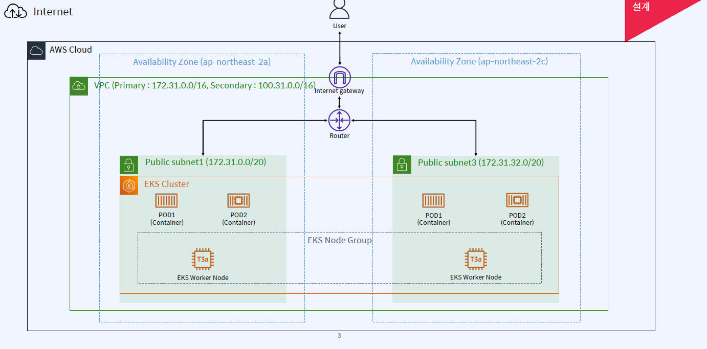

* AWS 계정 만들면 제공되는 VPC 그대로 사용.
* 고가용성을 위해 클러스터를 구성하는 두 개의 노드를 서로 다른 리전에 위치시킴.

# 실제 실습 순서

1. Security Group 생성
2. IAM Role 및 Policy 생성
3. EKS Cluster 생성
4. EKS Node Group 생성
5. AWS Configure 및 Kubeconfig 설정
6. 파드 배포

# 실습 진행!

## Ubuntu 환경에 aws-cli 설치

`sudo apt install awscli` 명령어 실행.  
이후 `aws` 명령어로 AWS 관련 명령 수행 가능.

### AWS 계정 액세스 키 설정

1. AWS 콘솔에서 `보안 자격 증명` 메뉴로 접속.
2. `액세스 키(액세스 키 ID 및 비밀 액세스 키)` 탭 선택.
3. 있다면 기존 것 사용, 없다면 `새 액세스 키 만들기` 버튼 눌러서 새로 만듬.
4. 화면에 나오는 정보를 `aws configure` 명령어 수행해서 입력.

## 0. 사전 네트워크 확인

### VPC 확인

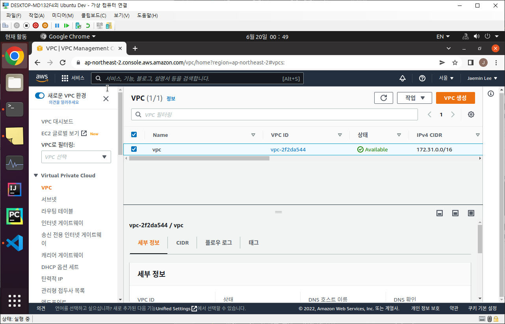

AWS 계정 생성 시 하나는 무조건 주어짐.

### VPC 서브넷 확인

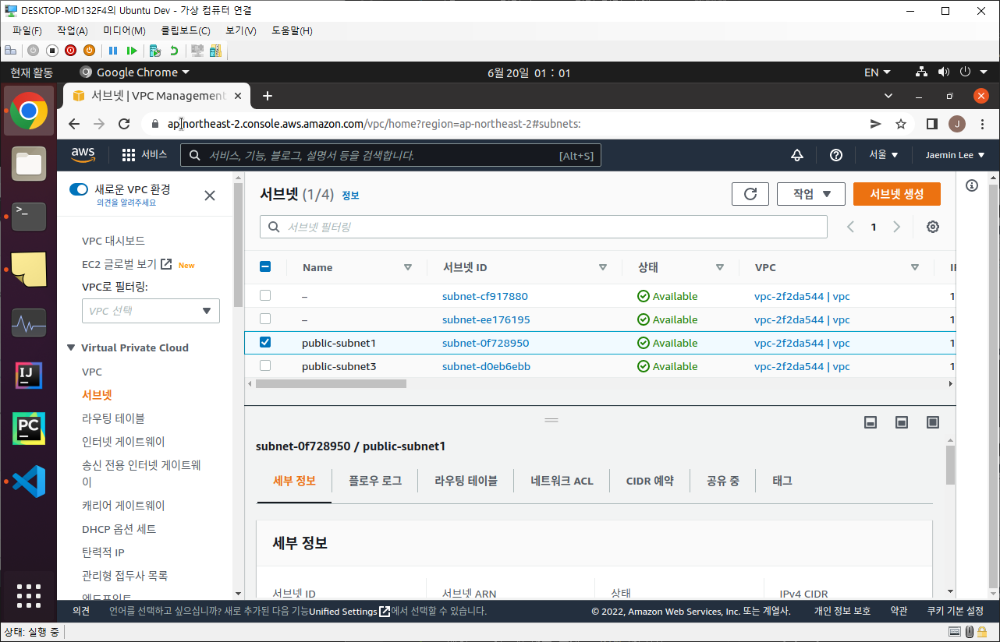

서브넷은 태그 지정이 필요함.  
*태그 지정은 필히 클러스터 생성 전에 진행해야 함!!*

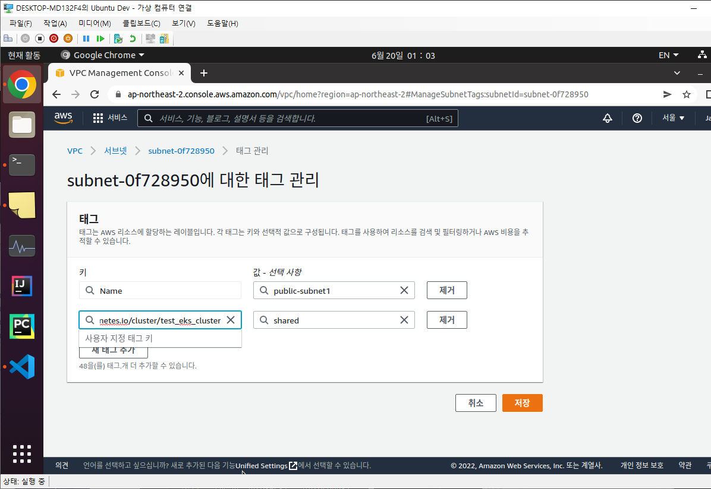

### VPC 라우팅 테이블 확인

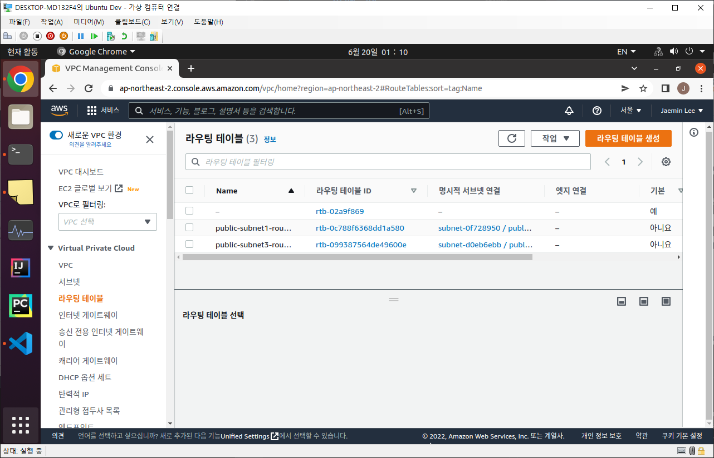

신규 라우팅 테이블을 두 개 만들고, 각 테이블을 아까 확인한 VPC 서브넷에 하나 씩 연결해야 함.  
라우팅 규칙으로 0.0.0.0/0 규칙으로 "인터넷 게이트웨이"에 연결해야 함.  
로컬만이 아닌 외부 액세스 허용 용도인 것으로 보임.

### VPC 인터넷 게이트웨이 확인

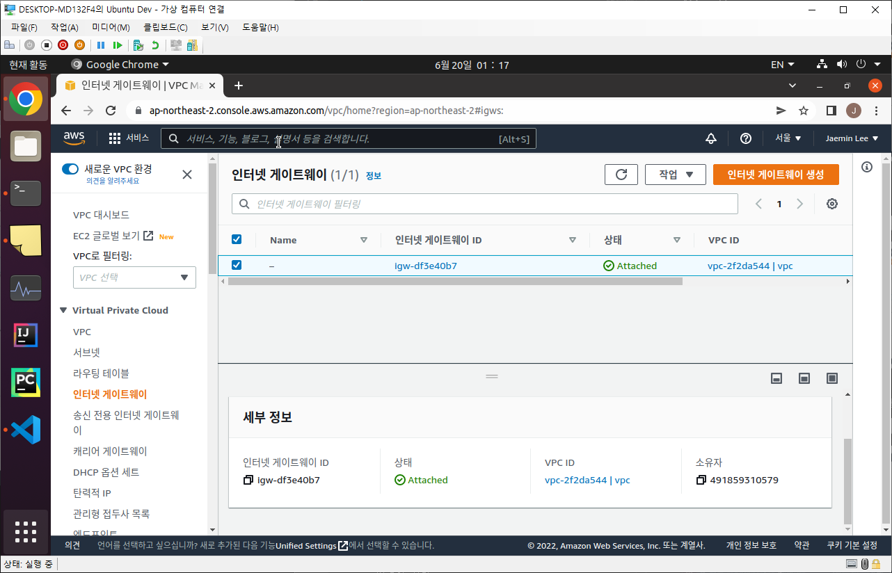

VPC가 생성될 때 인터넷 게이트웨이도 하나가 무조건 생성.  

## 1. Security Group 생성

### 보안 그룹

맨 처음 `보안/보안 그룹` 탭에 들어가서 보면 기본 보안 규칙 하나만 있는데, 여기서 항목 추가가 필요함.  

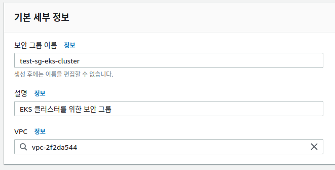

인바운드 규칙이 외부에서 내부로 들어오는 트래픽에 대한 규칙을 정의하는 곳인데(인그레스라고 부르기도 함), 이 쪽에 규칙 추가가 필요.  
실제 운영 환경에서는 오픈할 항목에 대해서만 까다롭게 관리해야 하지만, 실습 항목에서는 편의성을 위해 전부 오픈.  

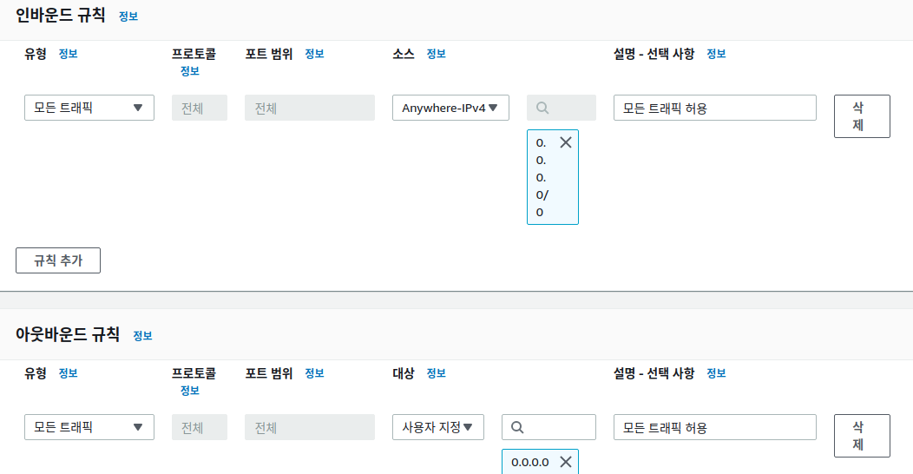

마지막으로 태그로 Name: <아까 지정한 그룹 이름> 지정하고 생성.
+) 그림 상에서는 한글로 설명을 적어뒀는데, 이렇게 하니까 만들 때 에러 뜸. 내부 설정에 한글이 없게끔 설정!

## 2. IAM Role 및 Policy 생성

AWS IAM 서비스로 이동해야 함.  
EKS 클러스터를 위한 역할과 EKS 노드를 위한 역할을 따로 정의할 예정.  
`IAM/액세스 관리/역할` 메뉴로 접속해서 `역할 만들기` 버튼 클릭.  
`사용자 지정 신뢰 정책` 항목을 선택하면 아래에 json 형태로 정책을 정의하도록 유도함.  
EKS 클러스터를 위한 역할은 `Statement.Principal` 항목에 `"Service": "eks.amazonaws.com"` 항목만 추가하면 되고,  
EKS 노드를 위한 역할은 `Statement.Principal` 항목에 `"Service": "ec2.amazonaws.com"` 항목만 추가하면 됨.  

이후 EKS 클러스터를 위한 역할에 `AmazonEKSClusterPolicy`, `AmazonEKSVPCResourceController` 정책을 추가하고 생성.  
EKS 노드를 위한 역할에는 `AmazonEKSWorkerNodePolicy`, `AmazonEKS_CNI_Policy`, `AmazonEC2ContainerRegistryReadOnly` 정책을 추가하고 생성.  

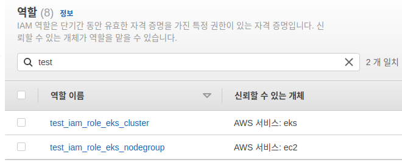

## 3. EKS Cluster 생성

AWS Elastic Kubernetes Service 서비스로 이동.  
`EKS/클러스터/클러스터 생성` 메뉴로 접속.  

`클러스터 서비스 역할` 항목에서는 앞에서 선택한 IAM 역할 중 EKS 클러스터를 위한 역할로 선택.  
이렇게 설정하면 실제 EKS 클러스터가 생성되었을 때 IAM 역할에 정의했던 내용 그대로 서비스 접근과 권한이 정의됨.  

`네트워킹` 항목 중 `VPC`는 기본 VPC로, 서브넷의 경우 앞서 설정했던 두 개의 서브넷만 체크.  
`보안 그룹` 항목도 앞서 만들었던 보안 그룹으로 지정.  
`클러스터 엔드포인트 액세스` 항목도 VPC 외부에서 접근이 가능해야 하므로 퍼블릭.

`로깅` 영역에서는 EKS 제어 플레인에서 제공하는 로그에 대해 선택할 수 있음.  
기본적으로 AWS EKS는 모든 내부 작동 내역이나 에러 등을 블랙박스화 시켜서 사용자에게 선별적으로 보여줌.  
이 영역은 그 데이터 중 어떤 데이터를 제공받을지에 대한 옵션.  
실습에서는 비활성화 둔 상태로 스킵하지만, 이후 테라폼 사용해서 실습할 때 다시 설정할 예정.

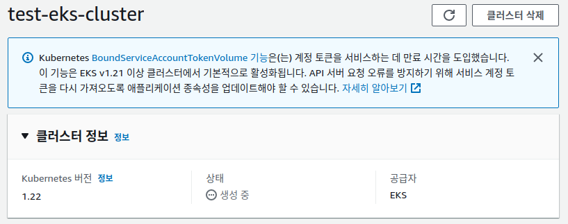

## 4. EKS Node Group 생성

앞에서 생성한 EKS 클러스터가 활성화되면, 해당 클러스터를 선택해서 내부 메뉴를 확인.  
`컴퓨팅/노드 그룹`에 들어가면 노드 그룹이 없는데, 여기서 하나를 생성.  
`노드 IAM 역할` 항목에서는 앞서 만든 IAM 역할 중 노드 그룹용 역할을 선택.  

이후 노드의 스펙을 정할 수 있음.  
본 실습에서는 Linux(x86-64), t3a-medium 옵션으로 지정.  
노드 수는 최소 1, 최대 3, 기본 2.  

`노드 그룹 네트워크 구성` 항목에서 이전에 지정한 서브넷 두 개가 제대로 보이는지 확인.

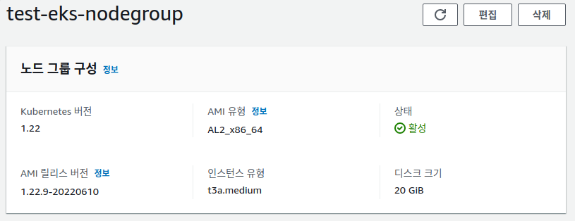  
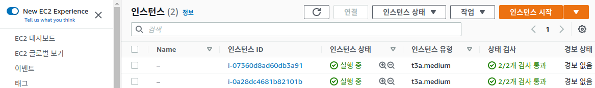

## 5. AWS Configure 및 Kubeconfig 설정

로컬 개발 환경에서 위에서 만든 EKS 환경과 연결이 필요.  
먼저 AWS CLI 설치 + 액세스 키 준비 필요.  
아래 커맨드로 Kubectl 사용을 위한 Kubeconfig 설정이 가능:  
`$ aws eks update-kubeconfig --region <Region명> --name <EKS명>`  
물론 `aws configure` 시 리전을 적었다면 region 관련 옵션은 생략 가능.  

이후 kubectl 명령어로 EKS 클러스터와 정상적으로 연결이 되었는지 확인.

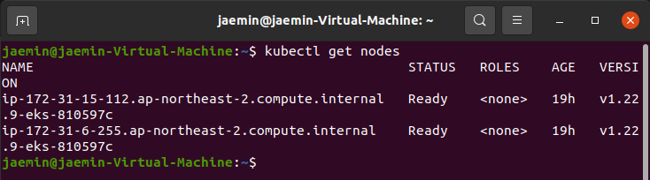

### kubectl 동작 시 `error: exec plugin: invalid apiversion "client.authentication.k8s.io/v1alpha1"` 발생할 경우 대처법

필자가 경험한 에러로, 대처법을 아래에 기술함:

* 원인: 기존 kubectl 클라이언트 버전과 AWS EKS에서 필요로 하는 kubectl 클라이언트 버전이 맞지 않음.
* 해결: AWS 공식 페이지에서 제공하는 kubectl 설치법을 따라 현재 있는 kubectl 바이너리 파일을 덮어씀.

## 6. 파드 배포

이미 많이 해본 것 처럼, 제공된 실습 매니페스트 파일을 `kubectl apply` 명령어로 실행!

# 테라폼에 대해

본 실습에서는 테라폼을 오직 AWS EKS 클러스터 관리용으로만 사용함.  
테라폼에 대해 더 자세하게 알고 싶다면, 아래 링크 참조:  
https://learn.hashicorp.com/tutorials/terraform/infrastructure-as-code

## 테라폼 기본 리소스

AWS 관련 예제는 아래 링크를 참조:  
https://registry.terraform.io/providers/hashicorp/aws/latest/docs/

### Resource = 리소스

프로비저닝할 리소스의 오브젝트를 정의함.  
각 리소스는 오직 하나의 리소스 타입만 가지며, 리소스 내에 사용 가능한 변수를 설정할 수 있음.

```
resource "aws_eks_cluster" "example" {
  name     = "example"
  role_arn = aws_iam_role.example.arn

  vpc_config {
    subnet_ids = [aws_subnet.example1.id, aws_subnet.example2.id]
  }

  # Ensure that IAM Role permissions are created before and deleted after EKS Cluster handling.
  # Otherwise, EKS will not be able to properly delete EKS managed EC2 infrastructure such as Security Groups.
  depends_on = [
    aws_iam_role_policy_attachment.example-AmazonEKSClusterPolicy,
    aws_iam_role_policy_attachment.example-AmazonEKSVPCResourceController,
  ]
}

output "endpoint" {
  value = aws_eks_cluster.example.endpoint
}

output "kubeconfig-certificate-authority-data" {
  value = aws_eks_cluster.example.certificate_authority[0].data
}
```

### Providers = 프로바이더

사용자가 관리하기를 원하는 인프라 서비스를 뜻함.  
1000개 이상의 다양한 서비스 프로바이더를 제공.  
사용자가 원하는 인프라에 프로비저닝할 수 있도록 설정 가능.
프로바이더 목록은 아래 링크를 참고:  
https://registry.terraform.io/browse/providers

### Data Source = 데이터 소스

Provider에서 제공하는 리소스 정보를 가져옴.  
테라폼에서 사용 가능한 형태로 연결.  
필터를 통해 정보를 가져올 수 있음.

```
data "aws_eks_cluster" "example" {
  name = "example"
}

output "endpoint" {
  value = data.aws_eks_cluster.example.endpoint
}

output "kubeconfig-certificate-authority-data" {
  value = data.aws_eks_cluster.example.certificate_authority[0].data
}

# Only available on Kubernetes version 1.13 and 1.14 clusters created or upgraded on or after September 3, 2019.
output "identity-oidc-issuer" {
  value = data.aws_eks_cluster.example.identity[0].oidc[0].issuer
}
```

### Variables = 변수

테라폼의 .tf 파일 내에서 사용 가능한 변수를 지정함.
테라폼 명령어가 실행되는 디렉토리 내에 있는 파일에서 사용 가능.  
리소스, 프로바이더, 데이터 소스에서 모두 변수 지정해서 사용 가능!  
사용법은 아래 링크를 참고:  
https://www.terraform.io/language/values/variables

## 테라폼 기본 명령어

* 테라폼 초기화 (Init)  
`$ terraform init`
* 테라폼 프로비저닝 코드 검증 (Dry Run)  
`$ terraform plan`
* 테라폼 프로비저닝 수행 (Run)  
`$ terraform apply`

* 테라폼 프로비저닝 적용 삭제 코드 검증 (Dry Run)
`$ terraform plan --destroy`
* 테라폼 프로비저닝 적용 삭제 수행 (Run)
`$ terraform destroy`

# 테라폼으로 AWS EKS 프로비저닝 실습

앞에서는 AWS 콘솔을 통해 AWS 네트워크 설정, 보안 그룹, IAM 역할, EKS 클러스터 생성과 노드 그룹 생성 등을 진행했음.  
이 일련의 작업들을 테라폼을 통해 프로비저닝하는 방법을 확인!

## 테라폼 코드 해석

### 테라폼 프로바이더 설정 코드

```
# 테라폼 버전 명시
terraform {
  required_version = ">= 1.0"
}

# 어떤 인프라를 사용하는지 설정, 설정한 변수에서 리전 항목을 가져옴
# 변수 tf 파일은 동일 디렉토리 내에 있어야 함
provider "aws" {
  region = var.aws_region
}

# 데이터 소스 선언, aws_availability_zones 정보를 가져옴 
data "aws_availability_zones" "available" {
  exclude_names = ["ap-northeast-2a","ap-northeast-2c"]
}
```

### 테라폼 변수 설정 코드

```
# 변수 aws_region 정의, 값은 ap-northeast-2
variable "aws_region" {
  default = "ap-northeast-2"
}

# 변수 cluster-name 정의, 값은 test-eks-cluster, 타입은 string
variable "cluster-name" {
  default = "test-eks-cluster"
  type    = string
}
```

### EKS 클러스터 생성 코드

```
# 리소스 선언, aws_eks_cluster 타입의 리소스, 리소스 이름은 test-eks-cluster
resource "aws_eks_cluster" "test-eks-cluster" {

  # 종속성 선언, 클러스터 생성 이전에 작업이 완료되어야 하는 부분
  # AWS EKS 생성을 위해서는 AWS IAM 역할이 정의되어야 하므로, 해당 부분을 종속성에 추가
  depends_on = [
    aws_iam_role_policy_attachment.test-iam-policy-eks-cluster,
    aws_iam_role_policy_attachment.test-iam-policy-eks-cluster-vpc,
  ]

  # 설정한 변수에서 클러스터 이름 항목을 가져옴
  # 변수 tf 파일은 동일 디렉토리 내에 있어야 함
  name     = var.cluster-name

  # AWS 리소스를 생성하려면 해당 리소스의 IAM 역할 정의가 필요함
  # 리소스의 IAM 역할 정의하는 부분, arn이란 해당 리소스의 고유한 이름
  role_arn = aws_iam_role.test-iam-role-eks-cluster.arn

  # 쿠버네티스 버전 명시
  version = "1.21"

  # 클러스터 제어 플레인에서 제공할 로그 종류 선택
  enabled_cluster_log_types = ["api", "audit", "authenticator", "controllerManager", "scheduler"]

  # 어떤 AWS VPC 위에서 생성할 것인지 VPC 정보 명시
  vpc_config {
    security_group_ids = [aws_security_group.test-sg-eks-cluster.id]
    subnet_ids         = ["subnet-0f728950","subnet-d0eb6ebb"] # 이 부분은 개인 AWS 계정의 서브넷 ID로 채워야 함!
    endpoint_public_access = true
  }
}
```

### EKS 노드 그룹 생성 코드

```
# 리소스 선언, aws_eks_node_group 타입의 리소스, 리소스 이름은 test-eks-nodegroup
resource "aws_eks_node_group" "test-eks-nodegroup" {
  cluster_name    = aws_eks_cluster.test-eks-cluster.name
  node_group_name = "test-eks-nodegroup"
  node_role_arn   = aws_iam_role.test-iam-role-eks-nodegroup.arn
  subnet_ids      = ["subnet-0f728950","subnet-d0eb6ebb"] # 이 부분은 개인 AWS 계정의 서브넷 ID로 채워야 함!
  instance_types = ["t3a.medium"]
  disk_size = 20

  # AWS 리소스가 가질 레이블까지 생성 가능
  labels = {
    "role" = "eks-nodegroup"
  }

  # AWS 노드 그룹에서 설정 가능한 노드 스케일링 전략 명시
  scaling_config {
    desired_size = 2
    min_size     = 1
    max_size     = 3
  }

  # 종속성 선언, EKS 노드 그룹에 대한 AWS IAM 정책을 참조하도록 종속성에 추가
  depends_on = [
    aws_iam_role_policy_attachment.test-iam-policy-eks-nodegroup,
    aws_iam_role_policy_attachment.test-iam-policy-eks-nodegroup-cni,
    aws_iam_role_policy_attachment.test-iam-policy-eks-nodegroup-ecr,
  ]

  # 해당 노드 그룹이 가지는 리소스에 대한 태깅 전략 명시
  tags = {
    "Name" = "${aws_eks_cluster.test-eks-cluster.name}-worker-node"
  }
}

```

### IAM 역할 생성 코드

```
############ eks cluster iam role ############

# 리소스 선언, aws_iam_role 타입의 리소스, 리소스 이름은 test-iam-role-eks-cluster
# EKS 클러스터에 대한 IAM 역할 정의
resource "aws_iam_role" "test-iam-role-eks-cluster" {
  name = "test-iam-role-eks-cluster"

  # IAM 역할을 정의하는 json 데이터를 아예 그대로 붙여서 사용
  assume_role_policy = <<POLICY
{
"Version": "2012-10-17",
"Statement": [
    {
    "Effect": "Allow",
    "Principal": {
        "Service": "eks.amazonaws.com"
    },
    "Action": "sts:AssumeRole"
    }
]
}
POLICY
}

# 리소스 선언, aws_iam_role에 추가되는 IAM 정책 정의
# IAM 역할 내부에서 선언하는 것이 아니라, 따로 리소스로 선언하고 정책 쪽에서 역할에 링크
resource "aws_iam_role_policy_attachment" "test-iam-policy-eks-cluster" {

  # 실제로 추가할 정의의 주소
  policy_arn = "arn:aws:iam::aws:policy/AmazonEKSClusterPolicy"
  
  # 어떤 IAM 역할과 연결될 것인지 명시
  role       = aws_iam_role.test-iam-role-eks-cluster.name
}

# 리소스 선언, aws_iam_role에 추가되는 IAM 정책 정의
resource "aws_iam_role_policy_attachment" "test-iam-policy-eks-cluster-vpc" {
  
  # 실제로 추가할 정의의 주소
  policy_arn = "arn:aws:iam::aws:policy/AmazonEKSVPCResourceController"

  # 어떤 IAM 역할과 연결될 것인지 명시
  role       = aws_iam_role.test-iam-role-eks-cluster.name
}


############ eks nodegroup iam role ############

# 리소스 선언, aws_iam_role 타입의 리소스, 리소스 이름은 test-iam-role-eks-nodegroup
# EKS 노드 그룹에 대한 IAM 역할 정의
resource "aws_iam_role" "test-iam-role-eks-nodegroup" {
  name = "test-iam-role-eks-nodegroup"

  assume_role_policy = <<POLICY
{
  "Version": "2012-10-17",
  "Statement": [
    {
      "Effect": "Allow",
      "Principal": {
        "Service": "ec2.amazonaws.com"
      },
      "Action": "sts:AssumeRole"
    }
  ]
}
POLICY
}

# 리소스 선언, aws_iam_role에 추가되는 IAM 정책 정의
resource "aws_iam_role_policy_attachment" "test-iam-policy-eks-nodegroup" {
  policy_arn = "arn:aws:iam::aws:policy/AmazonEKSWorkerNodePolicy"
  role       = aws_iam_role.test-iam-role-eks-nodegroup.name
}

# 리소스 선언, aws_iam_role에 추가되는 IAM 정책 정의
resource "aws_iam_role_policy_attachment" "test-iam-policy-eks-nodegroup-cni" {
  policy_arn = "arn:aws:iam::aws:policy/AmazonEKS_CNI_Policy"
  role       = aws_iam_role.test-iam-role-eks-nodegroup.name
}

# 리소스 선언, aws_iam_role에 추가되는 IAM 정책 정의
resource "aws_iam_role_policy_attachment" "test-iam-policy-eks-nodegroup-ecr" {
  policy_arn = "arn:aws:iam::aws:policy/AmazonEC2ContainerRegistryReadOnly"
  role       = aws_iam_role.test-iam-role-eks-nodegroup.name
}
```

### VPC 보안 그룹 생성 코드

```
# 리소스 선언, aws_security_group 타입의 리소스, 리소스 이름은 test-sg-eks-cluster
resource "aws_security_group" "test-sg-eks-cluster" {
  name        = "test-sg-eks-cluster"
  description = "security_group for test-eks-cluster"
  vpc_id      = "vpc-2f2da544" # 이 부분은 개인 AWS 계정의 VPC ID로 채워야 함!

  tags = {
    Name = "test-sg-eks-cluster"
  }
}

# 리소스 선언, aws_security_group_rule 타입의 리소스, 리소스 이름은 test-sg-eks-cluster-ingress
# AWS의 경우 block-based 규칙을 적용하며, 아래 내용에 명시되지 않은 출처로부터의 트래픽은 차단
resource "aws_security_group_rule" "test-sg-eks-cluster-ingress" {

  # 보안 그룹의 규칙을 정의하며 어떤 보안 그룹 소속인지 명시
  security_group_id = aws_security_group.test-sg-eks-cluster.id
  
  # 인바운드 타입 규칙임을 명시
  type              = "ingress"
  description       = "ingress security_group_rule for test-eks-cluster"
  from_port         = 0
  to_port           = 0
  protocol          = "-1"
  cidr_blocks       = ["0.0.0.0/0"]
}

# 리소스 선언, aws_security_group_rule 타입의 리소스, 리소스 이름은 test-sg-eks-cluster-egress
# AWS의 경우 block-based 규칙을 적용하며, 아래 내용에 명시되지 않은 출처로부터의 트래픽은 차단
resource "aws_security_group_rule" "test-sg-eks-cluster-egress" {

  # 보안 그룹의 규칙을 정의하며 어떤 보안 그룹 소속인지 명시
  security_group_id = aws_security_group.test-sg-eks-cluster.id

  # 아웃바운드 타입 규칙임을 명시
  type              = "egress"
  description       = "egress security_group_rule for test-eks-cluster"
  from_port         = 0
  to_port           = 0
  protocol          = "-1"
  cidr_blocks       = ["0.0.0.0/0"]
}
```

## 테라폼 실행

### 테라폼 초기화 (Init)

터미널 위치를 .tf 파일들이 모여있는 디렉토리로 옮겨서 `terraform init` 명령어로 초기화 진행.

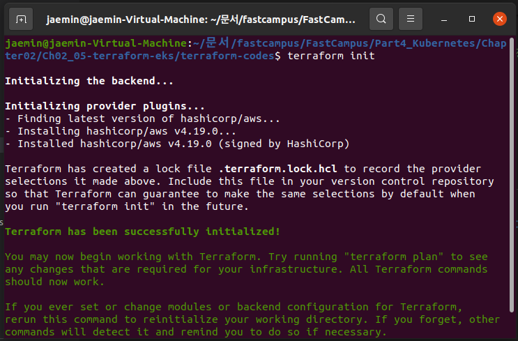

### 테라폼 프로비저닝 코드 검증 (Dry Run)

해당 디렉토리에서 `terraform plan` 명령어 수행.  
현재 디렉토리에 있는 .tf 파일들을 스캔하고 현재 기준으로 현재 프로바이더에 어떤 작업을 해야 하는지 정리함.

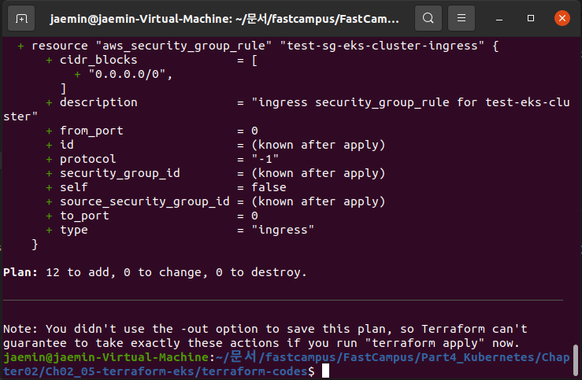

### 테라폼 프로비저닝 수행 (Run)

Dry Run 단계에서 계획할 동작을 실제 수행.  
`terraform apply` 명령어를 수행하면 실제 프로바이더에 .tf 파일 내용을 실제 적용함.  

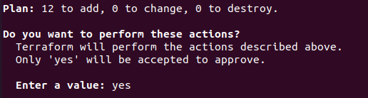
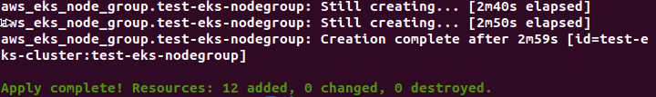

테라폼 작업 후 정상적으로 아래와 같이 EKS 클러스터가 생성됨을 알 수 있음.  

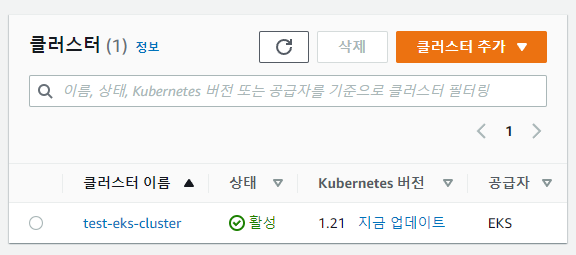
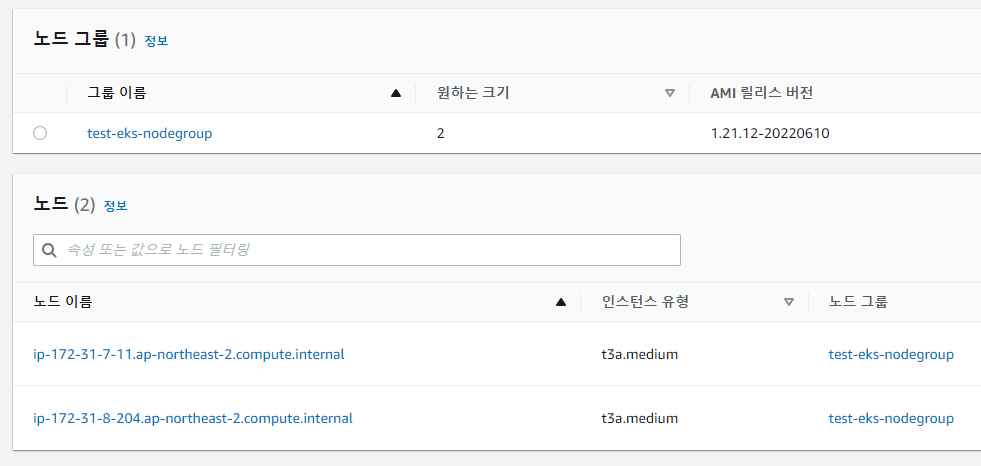

# 테라폼 공동 관리의 필요성? (Terraform Backend)

테라폼으로 인프라를 관리할 때 설정 파일을 만들고 이를 적용(apply)하면 terraform.tfstate라는 파일이 생성.  
이는 테라폼의 설정 파일로 실제 인프라에 적용하면서 나온 결과를 기억하고 있는 상태 파일.  
이후 설정 파일을 수정하거나 하면 "설정 파일", "상태 파일", "실제 인프라의 상태"를 비교해서 어떻게 적용할지를 판단하는 기준이 됨.  

## terraform.tfstate 관리의 문제점

* 동시에 두 사람이 작업한다면 terraform.tfstate가 달라지게 되어 충돌이 발생할 수 있음.  
이는 파일의 충돌뿐이 아니라 인프라에도 영향을 주므로 매우 위험.
* Git으로 작업하면서 pull로 가져오지 않고 작업한다면 실수로 이전 terraform.tfstate위에서 작업할 수 있음.

## terraform.tfstate 관리 전략

AWS S3 Bucket에 테라폼 tfstate 파일을 보관해서 유일한 파일로 공동 관리(암호화 + 버전 관리).  
DynamoDB에 테라폼 Lock을 보관해서 여러 명이 동시에 같은 시스템을 수정하지 못하도록 한 번에 하나의 사용자만 테라폼 동작을 수행할 수 있는 locking 전략을 제공.
이런 전략을 테라폼 백엔드라고 칭함.


아래는 이를 적용할 실제 실습의 deployment view.

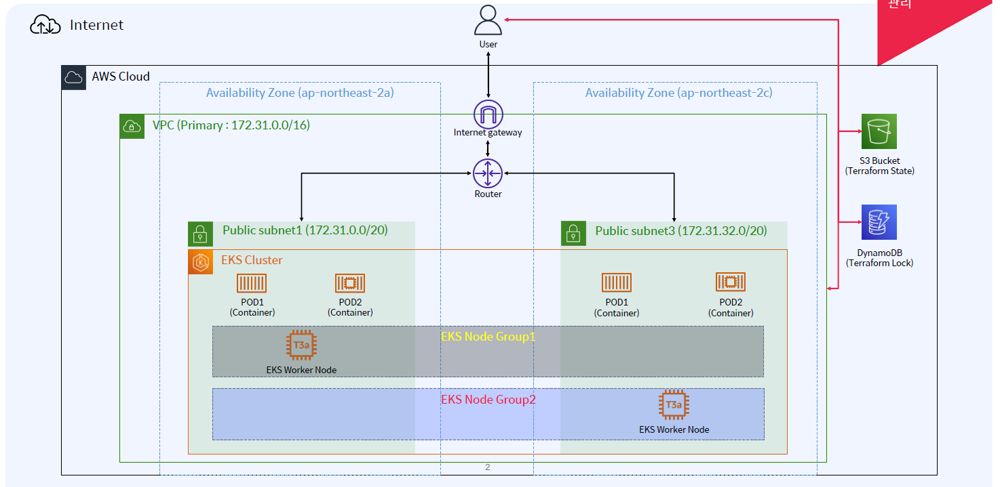

# Terraformer(= 테라포머)란?


기존 방식은 IaC라고 해서 코드를 인프라로 전환하는 형태. 이게 바로 테라폼.  
하지만 현재 인프라를 코드화시키는 기능은 없었음.  
그걸 해주는 오픈소스 서비스가 바로 테라포머.
현재 등록된 인프라에서 테라포머를 돌리면 이를 테라폼 설정 파일로 만들어줌.  
리버싱 테라폼!

# 부록

## 용어 정리

* 프로비저닝: 공급, 준비, 대비, 식량 이란 의미로, IT 에서 의미는 특정 서비스를 제공받기 위하여 서비스 실행부터 시작해 서비스를 제공받기 전 단계까지 처리되는 일련의 절차
* IAM: AWS 클라우드 인프라 안에서 신분과 접속/접근을 관리하기 위한 서비스.  
크게 사용자(Users), 그룹(Groups), 역할(Roles), 정책(Policies) 라는 종류로 구성됨.
* IAM 정책(Policy): IAM 리소스에 권한을 부여하는 방법.  
하나 이상의 AWS 리소스에 대한 어떤 작업을 수행할 수 있는지 허용 규칙을 JSON 형식으로 정의함.
이렇게 만들어진 정책이 IAM 사용자와 그룹, 역할에 연결됨.
* AWS VPC: Virtual Private Cloud, 사용자의 AWS 계정 전용 가상 네트워크.
* VPC 서브넷: VPC의 IP 주소 범위.
* VPC 라우팅 테이블: 네트워크 트래픽을 전달할 위치를 결정하는 데 사용하는 라우팅이라는 이름의 규칙 집합.
* VPC 인터넷 게이트웨이: VPC의 리소스와 인터넷 간의 통신을 활성화하기 위해 VPC에 연결하는 게이트웨이.