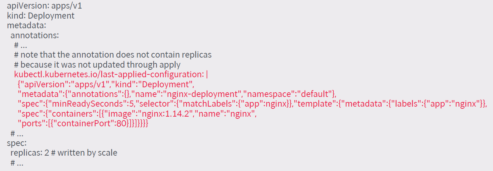
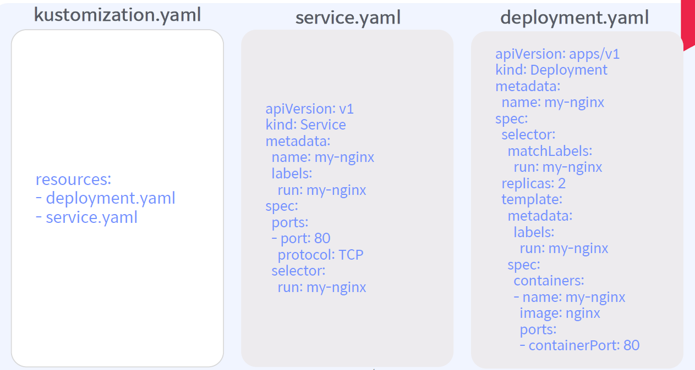

# 쿠버네티스 매니페스트란?

```
apiVersion: apps/v1

kind: Deployment

metadata:
  name: nginx-deployment

spec:
  selector:
    matchLabels:
      app: nginx
  minReadySeconds: 5
  template:
    metadata:
      labels:
        app: nginx
    spec:
      containers:
      - name: nginx
        image: nginx:1.14.2
        ports:
        - containerPort: 80
```

    매니페스트란, 쿠버네티스의 오브젝트를 생성하기 위한 메타 정보를 YAML이나 JSON으로 기술한 파일.

일반적으로 쿠버네티스 오브젝트를 생성하는 설계도로서의 역할을 하며, 현재 운영 중인 서비스의 사양을 관리하고 변경하는 등의 기능으로도 사용.  

## 매니페스트 관련 명령어

* 오브젝트 생성/업데이트
`$ kubectl apply -f <Manifest 파일>`
* 오브젝트의 생성/업데이트 비교 (Dry run)
`$ kubectl diff -f <Manifest 파일>`
* Manifest 기반으로 생성된 오브젝트 생성/업데이트 현황 출력
`$ kubectl get -f <Manifest 파일> -o yaml`

## 오브젝트 업데이트 시 이전 적용된 사항 확인 방법

해당 파드의 `kubectl get` 명령어로 정보를 보면 아래 그림과 같은 형태로 확인이 가능.  



## 매니페스트 별 사용 방향성


### Kustomize

쿠버네티스의 선언 방식 매니페스트 파일 자체를 활용. 배포에 용이!  
필요에 따라 패치를 통해 파드의 내용을 수정.  
쿠버네티스 오브젝트에 대한 추가/변경/삭제 관리를 도맡아 함.

### Helm Charts

쿠버네티스 선언 방식 매니페스트 파일을 템플릿과 values.yaml 파일로 다양한 방식으로 배포 관리.  
배포 가능 단위의 패키지화를 통해 다양한 워크로드를 대상으로 한 배포가 손쉬움.

# Kustomize(= 커스토마이즈)?

쿠버네티스 매니페스트 파일을 사용자가 쉽게 원하는대로 추가/변경/삭제하고 배포할 수 있게 돕는 툴.  
예전엔 따로 설치해서 kubectl과 연동해서 사용을 했지만 이젠 kubectl에 통합되어 하나의 기능처럼 사용이 가능.  
리눅스의 makefile과 유사한 feature?  
쿠버네티스의 관리 편의성과 자동화(CI/CD) 제어에 편리함을 제공함.

## Kustomize 기본 명령어

* kustomization 파일을 포함하는 디렉토리 내의 리소스 확인 방법  
`$ kubectl kustomize <kustomization 디렉토리>`
* Kustomize 리소스 적용  
`$ kubectl apply --kustomize <kustomization 디렉토리>`  
`$ kubectl apply ‒k <kustomization 디렉토리>`

# 커스토마이즈 사용 시나리오

## Case 1.



위와 같은 구성이 있다고 가정할 때, 서비스 매니페스트와 디플로이먼트 매니페스트는 따로 존재함.  
이 두 매니페스트를 하나의 yaml로 묶어서 한 번에 배포할 수 있게 함(`kubectl apply -k`).  
원래 폴더 단위 배포는 되는거 아니었나?  
폴더 안에서도 내가 원하는 요소들만 찝어서 한 번에 하나의 파일로 배포가 가능하다는데 의의가 있으며, CI/CD 파이프라인 작성 시 요긴하게 써먹을 수 있음.

# Helm Charts?