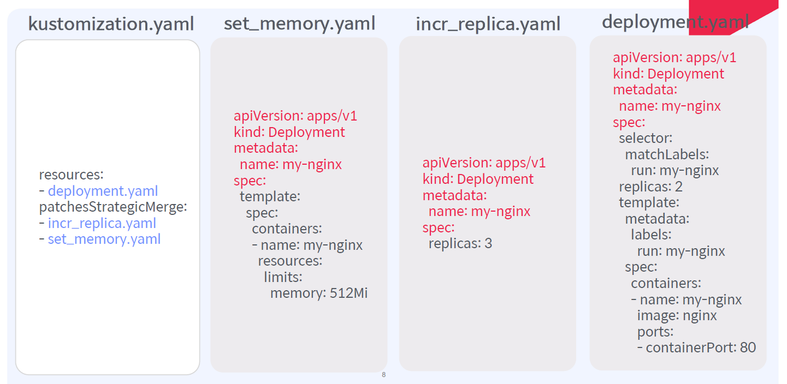
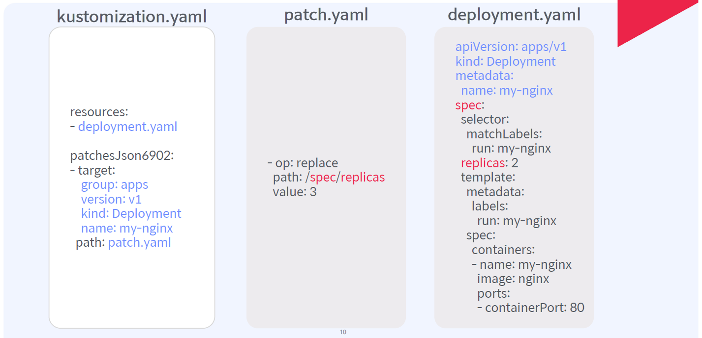
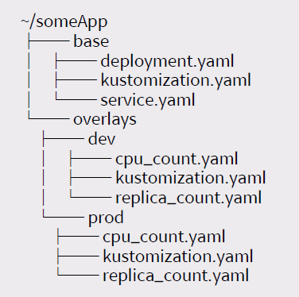
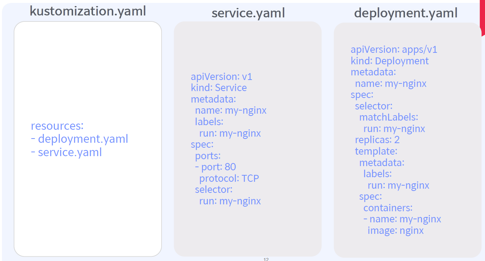
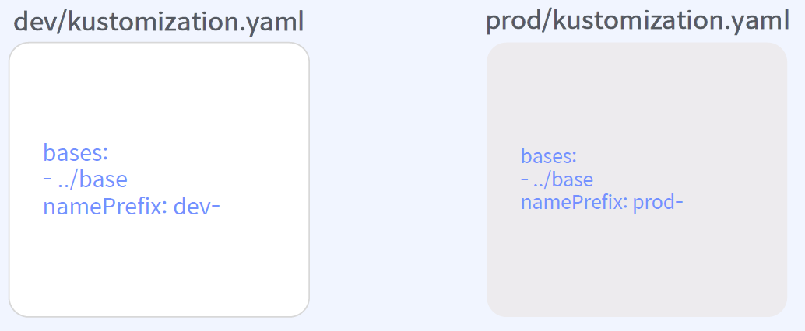

# 쿠버네티스 매니페스트란?

```
apiVersion: apps/v1

kind: Deployment

metadata:
  name: nginx-deployment

spec:
  selector:
    matchLabels:
      app: nginx
  minReadySeconds: 5
  template:
    metadata:
      labels:
        app: nginx
    spec:
      containers:
      - name: nginx
        image: nginx:1.14.2
        ports:
        - containerPort: 80
```

    매니페스트란, 쿠버네티스의 오브젝트를 생성하기 위한 메타 정보를 YAML이나 JSON으로 기술한 파일.

일반적으로 쿠버네티스 오브젝트를 생성하는 설계도로서의 역할을 하며, 현재 운영 중인 서비스의 사양을 관리하고 변경하는 등의 기능으로도 사용.  

## 매니페스트 관련 명령어

* 오브젝트 생성/업데이트
`$ kubectl apply -f <Manifest 파일>`
* 오브젝트의 생성/업데이트 비교 (Dry run)
`$ kubectl diff -f <Manifest 파일>`
* Manifest 기반으로 생성된 오브젝트 생성/업데이트 현황 출력
`$ kubectl get -f <Manifest 파일> -o yaml`

## 오브젝트 업데이트 시 이전 적용된 사항 확인 방법

해당 파드의 `kubectl get` 명령어로 정보를 보면 아래 그림과 같은 형태로 확인이 가능.  


## 매니페스트 별 사용 방향성


### Kustomize

쿠버네티스의 선언 방식 매니페스트 파일 자체를 활용. 배포에 용이!  
필요에 따라 패치를 통해 파드의 내용을 수정.  
쿠버네티스 오브젝트에 대한 추가/변경/삭제 관리를 도맡아 함.

### Helm Charts

쿠버네티스 선언 방식 매니페스트 파일을 템플릿과 values.yaml 파일로 다양한 방식으로 배포 관리.  
배포 가능 단위의 패키지화를 통해 다양한 워크로드를 대상으로 한 배포가 손쉬움.

# Kustomize(= 커스토마이즈)?

쿠버네티스 매니페스트 파일을 사용자가 쉽게 원하는대로 추가/변경/삭제하고 배포할 수 있게 돕는 툴.  
예전엔 따로 설치해서 kubectl과 연동해서 사용을 했지만 이젠 kubectl에 통합되어 하나의 기능처럼 사용이 가능.  
리눅스의 makefile과 유사한 feature?  
쿠버네티스의 관리 편의성과 자동화(CI/CD) 제어에 편리함을 제공함.

## 커스토마이즈 기본 명령어

* kustomization 파일을 포함하는 디렉토리 내의 리소스 확인 방법  
`$ kubectl kustomize <kustomization 디렉토리>`
* Kustomize 리소스 적용  
`$ kubectl apply --kustomize <kustomization 디렉토리>`  
`$ kubectl apply ‒k <kustomization 디렉토리>`

# 커스토마이즈 사용 시나리오


위와 같은 구성이 있다고 가정할 때, 서비스 매니페스트와 디플로이먼트 매니페스트는 따로 존재함.  
이 두 매니페스트를 하나의 yaml로 묶어서 한 번에 배포할 수 있게 함(`kubectl apply -k`).  
원래 폴더 단위 배포는 되는거 아니었나?  
폴더 안에서도 내가 원하는 요소들만 찝어서 한 번에 하나의 파일로 배포가 가능하다는데 의의가 있으며, CI/CD 파이프라인 작성 시 요긴하게 써먹을 수 있음.

# 커스토마이즈 사용 방식

`patchesStrategicMerge`와 `patchesJson6902` 두 가지 방식이 있으며, 각 상황에 맞게 사용이 필요!

## patchesStrategicMerge

* 패치 대상을 Kustomization에 병합하여 패치를 수행하는 방식(대상은 파편화,조각화된 패치).
* 패치하려는 매니페스트 내부의 오브젝트 이름은 반드시 대상으로 지정한 리소스 네임과 기본 템플릿과 일치해야 함!
* 매니페스트 개별적으로 오브젝트를 교체/병합/삭제하는 패치가 권장!

### 사용 방식

* replace: replace를 포함하는 요소가 병합되는 대신 대체
```
containers:
- name: nginx
  image: nginx-1.0
- $patch: replace
```
* merge: merge를 포함하는 요소가 대체되는 대신 병합
```
containers:
- name: nginx
  image: nginx-1.0
- name: log-tailer
  image: fluentd:latest
```
* delete: delete를 포함하는 요소가 삭제
```
containers:
- name: nginx
  image: nginx-1.0
- $patch: delete
  name: log-tailer
```

### 사용 예시



위 상황에서, deployment.yaml 파일은 `resources` 항목에 명시되어 패치가 실제로 적용되며 관리 대상이 됨.  
`patchesStrategicMerge` 항목에 명시되는 incr_replica.yaml 파일과 set_memory.yaml 파일은 deployment.yaml 파일에 적용되는 패치 파일임.  
사진에서 붉은 색으로 표시된 글귀는 변경 불가능한 부분이므로 모든 패치 파일에 동일하게 적용되어야 함.  
incr_replica.yaml 파일에서는 replicas 속성 수치를 2에서 3으로 증가시켰음.  
set_memory.yaml 파일에서는 my-nginx 컨테이너의 메모리 제한을 걸었음.  
위와 같은 상태로 apply 명령을 진행하면 deployment.yaml 파일을 베이스로 set_memory.yaml, incr_replica.yaml 파일의 내용을 덮어쓴 상태로 배포가 진행.

## patchesJson6902

* 쿠버네티스 오브젝트의 변경을 Json Patch 규약을 따름:
https://datatracker.ietf.org/doc/html/rfc6902
* 패치 대상의 정보는 패치 매니페스트 내부의 오브젝트 path에 맞춰서 value 값을 입력!
* Json 패치의 정확한 리소스를 찾기 위해,리소스의 group, version, kind, name을 kustomization.yaml 파일 내에 명시!

### 사용 방식

* add: path에 명시된 value를 추가
```
- op: add
  path: /spec/replicas
  value: 2
```
* replace: path에 명시된 value가 대체
```
- op: replace
  path: /spec/replicas
  value: 3
```
* remove: path에 명시된 value가 삭제
```
- op: remove
  path: /spec/replicas
```

### 사용 예시



위 상황에서, deployment.yaml 파일은 `resources` 항목에 명시되어 패치가 실제로 적용되며 관리 대상이 됨.  
`patchesJson6902` 항목에 명시되는 `target` 항목의 경우 deployment.yaml 파일 안에서 어떤 영역을 패치의 대상으로 정할지를 명시
(`apiVersion` 항목을 `group`과 `version` 두 항목으로 나눠 표시).  
patch.yaml 파일에서는 replicas 속성 수치를 해당 값 경로를 정의하여 수치를 3으로 변경함(replace).  
위와 같은 상태로 apply 명령을 진행하면 deployment.yaml 파일을 베이스로 patch.yaml 파일의 내용을 적용한 상태로 배포가 진행.

## Base와 Overlay 디렉토리로 환경 분리 전략

커스토마이즈 전략 중 하나로, 개발 환경과 배포 환경을 다르게 운영하고자 할 때 사용할 수 있는 전략임.  
환경의 기초가 되는 base 디렉토리를 기반으로, 각 환경마다 다른 부분을 overlay 디렉토리에 따로 kustomization 파일로 구성할 수 있어, 원하는 환경을 base + overlay 형태로 구성할 수 있음.



위와 같은 디렉토리를 구성했다고 가정함.  
`base`와 overlay 디렉토리에서 각각 다른 kustomization.yaml 파일을 구성할 수 있음.  



위 사진은 `base` 폴더에서 정의하는 kustomization.yaml 파일이며, 모든 overlay 폴더에서 참조하는 기본 디렉토리.



`dev` 디렉토리와 `prod` 디렉토리는 각 환경이 가지는 특별한 부분을 따로 정의한 디렉토리임.  
위 사진은 각 디렉토리에서 `base` 디렉토리를 기반으로 kustomization.yaml 파일을 구성했는지 보여줌.

# Helm(= 헬름)?

가장 기본적인 쿠버네티스 오브젝트 관리 방식은 쿠버네티스 매니페스트 파일(= yaml)로 통함.  
그런데 서비스 종류나 관리해야 하는 매니페스트 종류가 많아지면 관리에 어려움이 따름.  
이러한 다양한 매니페스트 그룹을 하나의 패키지로 묶어 관리할 수 있게 하는 도구가 바로 헬름!  
보편적으로 사용되고 있어 사실상 표준화?  


헬름을 사용함으로써 아래와 같은 장점을 누릴 수 있음:  
* 관리 복잡성 해소
  * 헬름 차트는 복잡한 어플리케이션을 쉽게 설치 및 반복 설치하도록 패키징
  * 헬름을 통해 여러 오브젝트를 한 번에 배포하도록 구성하여 관리 복잡성 해소
* 업데이트 용이
  * 배포된 어플리케이션에 대한 설정 변경 후 업데이트나 CLI 옵션을 통한 업데이트 용이
  * `Helm Upgrade` 명령어를 통해 업데이트 가능
* 쉬운 공유
  * 헬름 차트는 개인, 공용의 커스텀 헬름 리퍼지터리에 패키징해 쉬운 공유가 가능
  * 공식적인 특정 헬름 리퍼지터리에서 공개된 차트로 쿠버네티스에 바로 배포
* 버전 관리
  * 헬름을 통해서 설치하고 업데이트할 때 마다 Revision으로 버전 관리 가능
  * `Helm Rollback` 명령어를 통해 쉽게 이전 버전으로 Rollback 가능

# 헬름의 구성 요소

* Chart (패키지)
* Repository (패키지 저장소)
* Release (패키지의 인스턴스)

      쿠버네티스 내부에 헬름 차트를 원하는 헬름 리퍼지터리에서 검색 후 설치.  
      각 설치에 따른 새로운 헬름 릴리즈를 생성!
